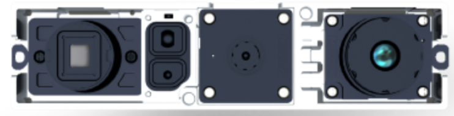

<a name="sensors"/>

## Sensors

<a name="cameras"/>

### Cameras

<a name="imagcameras"/>

#### Imaging Cameras 

<a name="globimagcameras"/>

##### Global Shutter Cameras 

<a name="openmvh7"/>

###### [OpenMV Cam H7](https://openmv.io/products/openmv-cam-h7)  
  
**Specifications** 
**Cost and Sourcing Link**: USD 65.00. [Buy here](https://openmv.io/products/openmv-cam-h7) 
**Sensor**: ON Semiconductor MT9V034 with optional [Global Shutter upgrade](https://openmv.io/collections/cams/products/global-shutter-camera-module)  
**Shutter Type**: Global with upgrade   
**Resolution and Frame rate**: 752 x 480 at 60 fps (Max.)   
**Sensor Size**: 1/3"  
**Color/Monochrome**: RGB Color  
**Lens Mount**: M12  
**Dimensions**: 45 mm x 36 mm x 30 mm 
**Weight**: 19 g   
**Additional Notes**: Comes with a Cortex M7 processor on-board at 400MHz, 256KB RAM and Micro SD Card support. Also supports MicroPython programming interface. 

<a name="jevois"/>

###### [JeVois Smart Machine Vision Camera](https://www.jevoisinc.com/)  
  
**Specifications** 
**Cost and Sourcing Link**: USD 49.99. [Buy here](https://www.jevoisinc.com/products/jevois-a33-smart-machine-vision-camera?variant=36249051018) 
**Sensor**: Omnivision OV9653 with optional [OnSemi AR0135 Global Shutter upgrade with InvenSense IMU ICM-20948](https://www.jevoisinc.com/products/jevois-1-2mp-global-shutter-sensor-with-9-dof-imu-upgrade-kit-color)  
**Shutter Type**: Rolling or Global with upgrade   
**Resolution and Frame rate**:  1280 x 1024  at 15 fps (Max.)   
**Sensor Size**: 1/3"  
**Color/Monochrome**: RGB Color  
**Lens Mount**: 1/4"  
**Dimensions**: 39 mm x 31 mm x 23 mm 
**Weight**: 17 g (including 5.4 g plastic case and 4.1 g cooling fan)   
**Additional Notes**: Comes with a Quad-core ARM Cortex A7 at 1.35 GHz, Dual core Mali 400 GPU, 256 MB RAM and can run vision algorithms on-board. 

<a name="see3cam11cug"/>

###### [See3CAM_11CUG](https://www.e-consystems.com/industrial-digital-camera.asp)  
  
**Specifications** 
**Cost and Sourcing Link**: USD 199.00. [Buy here](https://www.e-consystems.com/webstore.asp#See3CAM_11CUG) 
**Sensor**: ON Semiconductor AR0134CS  
**Shutter Type**: Global with upgrade   
**Resolution and Frame rate**: 1280 x 960 at 20 fps (Max.) Sensor supports upto 60 fps at Max. resolution.  
**Sensor Size**: 1/3"  
**Color/Monochrome**: RGB Color  
**Lens Mount**: C/CS  
**Dimensions**: 40 mm x 44 mm  
**Weight**: 25 g (without lens and without enclosure)   
**Additional Notes**:  

<a name="mvbluefox"/>

###### [Matrix Vision mvBlueFox-MLC200wC](https://www.matrix-vision.com/USB3-vision-camera-mvbluefox3.html)  
  
**Specifications** 
**Cost and Sourcing Link**: USD 999.00. [Buy here](https://www.matrix-vision.com/USB2.0-single-board-camera-mvbluefox-mlc.html?camera=mvBlueFOX-MLC200wC&selectInterface=Alle&selectMpixels=Alle&selectFps=Alle&selectSensor=Alle&selectColor=Alle&selectSize=Alle&selectShutter=Alle&selectModel=Alle&col=1&row=0&file=tl_files/mv11/support/mvIMPACT_Acquire/01/mvBlueFOX-x86-2.21.0.msi) 
**Sensor**: ON Semiconductor MT9V  
**Shutter Type**: Global   
**Resolution and Frame rate**: 752 x 480 at 93 fps (Max.)  
**Sensor Size**: 1/3"  
**Color/Monochrome**: RGB Color  
**Lens Mount**: C/CS  
**Dimensions**: 35 mm x 33 mm x 25 mm  
**Weight**: 10 g (without lens and without enclosure)   
**Additional Notes**:  

<a name="pointgreyflea3"/>

###### [Point Grey Flea3 e2v EV76C560](https://www.ptgrey.com/flea3-13-mp-color-usb3-vision-e2v-ev76c560-camera)  
  
**Specifications** 
**Cost and Sourcing Link**: USD 695.00. [Buy here](https://www.ptgrey.com/flea3-13-mp-color-usb3-vision-e2v-ev76c560-camera) 
**Sensor**: e2v EV76C560
  
**Shutter Type**: Global   
**Resolution and Frame rate**: 1280 x 1024 at 60 fps (Max.)  
**Sensor Size**: 1/1.8"  
**Color/Monochrome**: RGB Color  
**Lens Mount**: C  
**Dimensions**: 29 mm x 29 mm x 30 mm  
**Weight**: 41 g (without lens and without enclosure)   
**Additional Notes**:  

<a name="mynteye"/>

###### [Mynt Eye D](https://www.mynteye.com/pages/mynt-eye-d)  
  
**Specifications** 
**Cost and Sourcing Link**: USD 399.00. [Buy here](https://www.mynteye.com/products/mynt-eye-d-pre-order) 
**Sensor**: NA   
**Shutter Type**: Global   
**Resolution and Frame rate**: 2560 x 720 at 60 fps (Max.) and Depth at 1280 x 720 at 60 fps (Max.)  
**Baseline**: NA  
**Sensor Size**: NA  
**Color/Monochrome**: RGB Color  
**Lens Mount**: M12  
**Dimensions**: 145 mm x 20 mm x 28.6 mm 
**Weight**: 190 (with casing), 80 g (without casing)   
**Additional Notes**: Includes an IMU as well.  

<a name="tara"/>

###### [Tara](https://www.e-consystems.com/3D-USB-stereo-camera.asp)  
  
**Specifications** 
**Cost and Sourcing Link**: USD 299.00. [Buy here](https://www.e-consystems.com/webstore.asp#tara_Stereo_Vision_camera) 
**Sensor**: MT9V024  
**Shutter Type**: Global   
**Resolution and Frame rate**: 1504 x 480 at 60 fps (Max.)  
**Baseline**: 60 mm  
**Sensor Size**: 1/3"  
**Color/Monochrome**: RGB Color  
**Lens Mount**: M12  
**Dimensions**: 145 mm x 20 mm x 28.6 mm 
**Weight**: 80.5 (with casing), 28.5 g (without casing)   
**Additional Notes**: Includes an IMU as well.  

<a name="duomlx"/>

###### [Duo MLX](https://duo3d.com/product/duo-minilx-lv1)  
  
**Specifications** 
**Cost and Sourcing Link**: USD 695.00. [Buy here](https://duo3d.com/account) 
**Sensor**: NA  
**Shutter Type**: Global   
**Resolution and Frame rate**: 1504 x 480 at 45 fps (Max.)  
**Baseline**: 30 mm  
**Sensor Size**: 1/3"  
**Color/Monochrome**: RGB Color  
**Lens Mount**: M8  
**Dimensions**: 52 mm x 25 mm x 13 mm 
**Weight**: 12.5 g   
**Additional Notes**: Includes an IMU as well.  

<a name="zed"/>

###### [Zed](https://www.stereolabs.com/zed/)  
  
**Specifications** 
**Cost and Sourcing Link**: USD 449.00. [Buy here](https://store.stereolabs.com/products/zed) 
**Sensor**: NA  
**Shutter Type**: Rolling   
**Resolution and Frame rate**: 4416 x 1242 at 15 fps (Max.)  
**Baseline**: 120 mm  
**Sensor Size**: 1/3" BSI  
**Color/Monochrome**: RGB Color  
**Lens Mount**: M8  
**Dimensions**: 175 mm x 30 mm x 33 mm 
**Weight**: 159 g   
**Additional Notes**: Has Real time VIO at 100 Hz with position accuracy of 1 mm and orientation accuracy of 0.1 degrees.  

<a name="zedmini"/>

###### [Zed Mini](https://www.stereolabs.com/zed-mini/)  
  
**Specifications** 
**Cost and Sourcing Link**: USD 449.00. [Buy here](https://store.stereolabs.com/products/zed-mini/?_ga=2.206780435.1291925988.1556141046-637591444.1556141046) 
**Sensor**: NA  
**Shutter Type**: Rolling   
**Resolution and Frame rate**: 4416 x 1242 at 15 fps (Max.)  
**Baseline**: 63 mm  
**Sensor Size**: 1/3" BSI  
**Color/Monochrome**: RGB Color  
**Lens Mount**: M8  
**Dimensions**: 124.5 mm x 30.5 mm x 26.5 mm 
**Weight**: 62.9 g   
**Additional Notes**: Has Real time VIO at 100 Hz with position accuracy of 1 mm and orientation accuracy of 0.1 degrees.  

<a name="rollingimagcameras"/>

##### Rolling Shutter Cameras 

<a name="elp"/>

###### [ELP USB Camera](https://www.amazon.com/dp/B012CH5F58/ref=sspa_dk_detail_0?psc=1&pd_rd_i=B012CH5F58&pd_rd_w=C08fx&pf_rd_p=8a8f3917-7900-4ce8-ad90-adf0d53c0985&pd_rd_wg=wmekN&pf_rd_r=9BRH4KPT0RXJG111XN4V&pd_rd_r=bd919c96-6379-11e9-afd4-2da01f345a74)  
  
**Specifications** 
**Cost and Sourcing Link**: USD 48.99. [Buy here](https://www.amazon.com/dp/B012CH5F58/ref=sspa_dk_detail_0?psc=1&pd_rd_i=B012CH5F58&pd_rd_w=C08fx&pf_rd_p=8a8f3917-7900-4ce8-ad90-adf0d53c0985&pd_rd_wg=wmekN&pf_rd_r=9BRH4KPT0RXJG111XN4V&pd_rd_r=bd919c96-6379-11e9-afd4-2da01f345a74) 
**Sensor**: Aptina MI5100   
**Shutter Type**: Rolling   
**Resolution and Frame rate**: 2592 x 1944 at 15 fps (Max.)  
**Sensor Size**: 1/2.5"  
**Color/Monochrome**: RGB Color  
**Lens Mount**: M12  
**Dimensions**: 38 mm x 38 mm  
**Weight**: 10 g (with lens)   
**Additional Notes**:  

<a name="picam2"/>

###### [Raspberry Pi Camera Module V2](https://www.raspberrypi.org/products/camera-module-v2/)  
  
**Specifications** 
**Cost and Sourcing Link**: USD 29.95. [Buy here](https://www.adafruit.com/product/3099?src=raspberrypi) 
**Sensor**: Sony IMX219   
**Shutter Type**: Rolling   
**Resolution and Frame rate**: 1920 x 1080 at 30 fps (Max.)  
**Sensor Size**: 1/4"  
**Color/Monochrome**: RGB Color  
**Lens Mount**: M12  
**Dimensions**: 25 mm x 24 mm x 9 mm  
**Weight**: 3 g (with lens)   
**Additional Notes**: Similar Modules can be found at [ArduCam](http://www.arducam.com/). [Rolling Shutter Problems](https://www.raspberrypi.org/forums/viewtopic.php?t=177046). Can order multi-camera to one CSI connector [here](https://www.robotshop.com/en/arducam-multi-camera-adapter-bundle-kit.html?utm_source=Facebook&utm_medium=Paid&utm_campaign=ProdCatUS&fbclid=IwAR3mwmNXyikl8nogVYm0Hrzf7dzPlcX44rR_eLbZSRUaTU9_5lOM8-9Jrek).  

<a name="calicammono"/>

###### [CaliCam Fisheye Mono](https://astar.ai/collections/astar-products/products/calicam-mono)  
  
**Specifications** 
**Cost and Sourcing Link**: USD 49.00. [Buy here](https://astar.ai/11580702779/checkouts/656f0c88906342437dca38bec626f934) 
**Sensor**: NA   
**Shutter Type**: Rolling   
**Resolution and Frame rate**: 1280 x 960 at 30 fps (Max.)  
**Sensor Size**: NA  
**Color/Monochrome**: RGB Color  
**Lens Mount**: M12  
**Dimensions**: 38 mm x 38 mm  
**Weight**: NA (with lens)   
**Additional Notes**: Pre-calibrated to less than 0.3 px RMSE.  

<a name="calicamstereo"/>

###### [CaliCam Fisheye Stereo](https://astar.ai/collections/astar-products/products/stereo-camera)  
  
**Specifications** 
**Cost and Sourcing Link**: USD 139.00. [Buy here](https://astar.ai/11580702779/checkouts/4bfe57ca739d66f19d46733cdc454835) 
**Sensor**: NA   
**Shutter Type**: Rolling   
**Resolution and Frame rate**: 2560 x 960 at 30 fps (Max.)  
**Baseline**: 120 mm  
**Sensor Size**: NA  
**Color/Monochrome**: RGB Color  
**Lens Mount**: M12  
**Dimensions**: 150 mm x 30 mm  
**Weight**: NA (with lens)   
**Additional Notes**: Pre-calibrated to less than 0.3 px RMSE.  

<a name="rgbd"/>

##### RGBD Cameras 

<a name="xtion"/>

###### [Asus Xtion Pro Live](https://www.asus.com/us/3D-Sensor/Xtion_PRO_LIVE/)  
  
**Specifications** 
**Cost and Sourcing Link**: NA anymore.  
**Depth Range**: 800 mm to 3500 mm  
**Resolution and Frame rate**: Images at 1280 x 1024 at 30 fps (Max.), Depth at 640 x 480 at 30 fps (Max.)  
**Color/Monochrome**: RGB Color  
**Dimensions**: 457 mm x 89 mm x 127 mm 
**Weight**: 540 g   
**Additional Notes**: Includes microphones as well.  

<a name="realsense"/>

###### [Intel RealSense D435i](https://www.intelrealsense.com/depth-camera-d435i/)  
  
**Specifications** 
**Cost and Sourcing Link**: USD 199.00. [Buy here](https://store.intelrealsense.com/buy-intel-realsense-depth-camera-d435i.html?_ga=2.70691472.1422643180.1556026875-1272969693.1548211961) 
**Depth Range**: 105 mm to 10000 mm  
**Resolution and Frame rate**: Images at 1920 x 1080 at 30 fps (Max.), Depth at 1280 x 720 at 90 fps (Max.)  
**Color/Monochrome**: RGB Color  
**Dimensions**: 99 mm x 25 mm x 25 mm 
**Weight**: 540 g   
**Additional Notes**: Includes IMU as well. More versions available [here](https://store.intelrealsense.com/). 

<a name="astramini"/>

###### [Astra Mini](http://shop.orbbec3d.com/Astra-Mini_p_40.html)  
  
**Specifications** 
**Cost and Sourcing Link**: USD 159.99. [Buy here](http://shop.orbbec3d.com/Astra-Mini_p_40.html
) 
**Depth Range**: 600 mm to 5000 mm  
**Resolution and Frame rate**: Images and Depth at 640 x 480 at 30 fps (Max.)  
**Color/Monochrome**: RGB Color  
**Dimensions**: 80 mm x 20 mm x 20 mm 
**Weight**: NA   
**Additional Notes**: Has another model [Astra Mini S](http://shop.orbbec3d.com/Astra-Mini-S_p_41.html) with range from 350 mm to 1000 mm. Has [other RGB-D cameras](http://shop.orbbec3d.com/) as well. 

<a name="eventcameras"/>

##### Event Cameras 

<a name="davis240c"/>

###### [DAVIS 240C](https://inivation.com/buy/)  
  
**Specifications** 
**Cost and Sourcing Link**: USD 3525.00 with Academic Discount. [Buy here](https://inivation.com/buy/) 
**Imaging Shutter Type**: Global   
**Resolution and Event Rate**: 240 x 180 at 12 MEPS (Max.)  
**Sensor Size**: 1/3"  
**Color/Monochrome**: RGB Color  
**Lens Mount**: CS  
**Dimensions**: 56 mm x 62 mm x 28 mm  
**Weight**: 75 g (without lens)   
**Additional Notes**:  

<a name="davis346"/>

###### [DAVIS 346](https://inivation.com/buy/)  
  
**Specifications** 
**Cost and Sourcing Link**: USD 5678.00 with Academic Discount. [Buy here](https://inivation.com/buy/) 
**Imaging Shutter Type**: Global   
**Resolution and Event Rate**: 346 x 260 at 12 MEPS (Max.)  
**Sensor Size**: 1/3.33"  
**Color/Monochrome**: RGB Color  
**Lens Mount**: CS  
**Dimensions**: 40 mm x 60 mm x 25 mm  
**Weight**: 100 g (without lens)   
**Additional Notes**:  

<a name="insightness"/>

###### [Silicon Eye Rino 3.0](http://www.insightness.com/)  
  
**Specifications** 
**Cost and Sourcing Link**: USD 6000.00 with Academic Discount [Buy here](http://www.insightness.com/) 
**Imaging Shutter Type**: Global   
**Resolution and Event Rate**: 320 x 262 at 40 MEPS clocked at 10KHz (Max.)  
**Sensor Size**: 1/3.2"  
**Color/Monochrome**: RGB Color  
**Lens Mount**: M12  
**Dimensions**: 35 mm x 35 mm x 28 mm  
**Weight**: 15 g (without lens)   
**Additional Notes**: Includes an MPU-9250 IMU as well. Also includes event visual inertial odometry software package as well. 

<a name="prophesee"/>

###### [Prophesee VGA Sensor](https://www.prophesee.ai/)  
  
**Specifications** 
**Cost and Sourcing Link**: USD 4500.00 for camera and USD 1200.00 for sensor. [Buy here](https://www.prophesee.ai/) 
**Imaging Shutter Type**: Global   
**Resolution and Event Rate**: 640 x 480 at 40 MEPS clocked at 10KHz (Max.)  
**Sensor Size**: 3/4"  
**Color/Monochrome**: RGB Color  
**Lens Mount**: C  
**Dimensions**: 60 mm x 50 mm x 37 mm  
**Weight**: 146 g (with the lens)   
**Additional Notes**: Includes an IMU as well.  
