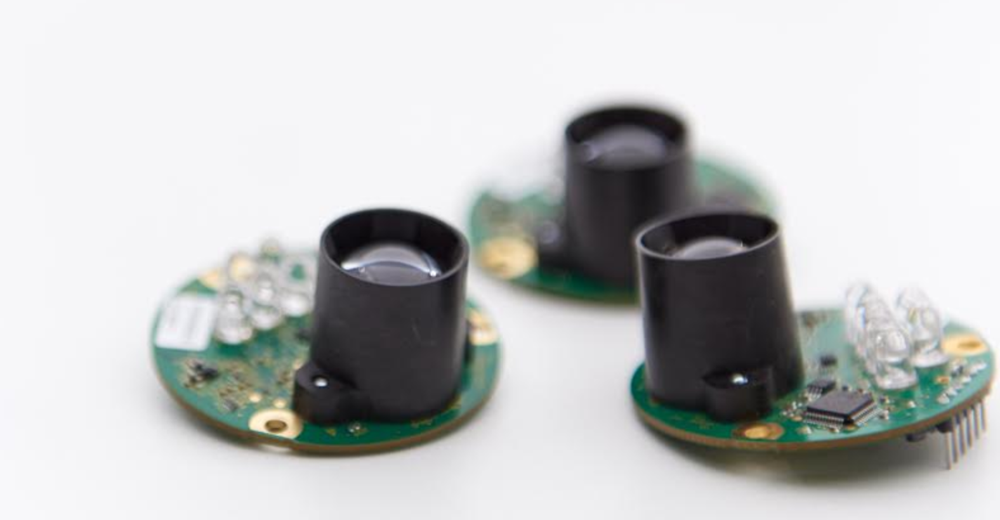
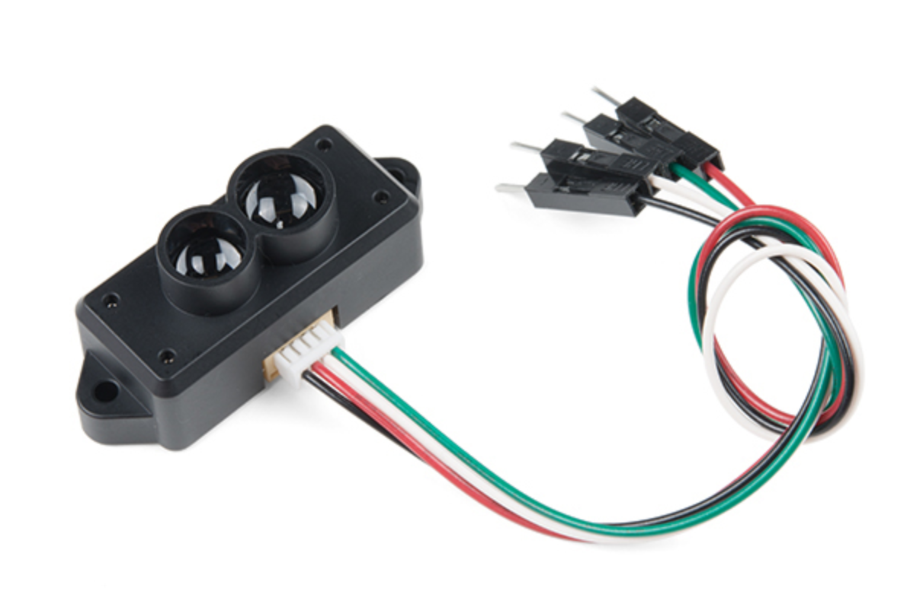

<a name="sensors"/>

## Sensors

<a name="lidar"/>

#### LIDAR

<a name="puck"/>

###### [Velodyne Puck VLP-16](https://velodynelidar.com/vlp-16.html)  
  
**Specifications** 
**Cost and Sourcing Link**: USD 4000.00 after the price cut in Jan, 2018. [Buy here](https://velodynelidar.com/vlp-16.html) 
**Measurement Range**: 100 m   
**Measurement Accuracy**: 3 cm   
**Field of View**: 3D, Vertical 30 degrees, Horizontal 360 degrees for 16 channels   
**Resolution**: Angular 0.1 - 0.4 degrees  
**Rate**: 20 Hz (Max.)  
**Dimensions**: 103.3 mm x 103.3 mm x 71.7 mm  
**Weight**: 830 g (without cabling and interface box)   
**Additional Notes**:  

<a name="rplidar"/>

###### [RPLidar A3](http://www.slamtec.com/en/lidar/A3)  
  
**Specifications** 
**Cost and Sourcing Link**: USD 599.00. [Buy here](https://www.robotshop.com/en/slamtec-rplidar-a3-360-laser-scanner-25-m.html) 
**Measurement Range**: 25 m   
**Measurement Accuracy**: 3 cm   
**Field of View**: 2D, Horizontal 360 degrees   
**Resolution**: Angular 0.3375 degrees   
**Rate**: 20 Hz (Max.)  
**Dimensions**: 76 mm x 76 mm x 41 mm  
**Weight**: 190 g   
**Additional Notes**:  

<a name="ouster"/>

###### [Ouster OS1](https://www.ouster.io/product-os1)  
  
**Specifications** 
**Cost and Sourcing Link**: USD 8000.00. [Buy here](https://www.ouster.io/talk-to-sales) 
**Measurement Range**: 120 m   
**Measurement Accuracy**: 3 cm   
**Field of View**: 3D, Vertical 33.2 degrees, Horizontal 360 degrees for 64 channels   
**Resolution**: Angular 0.18 degrees (horizontal), 0.52 degrees (vertical)  
**Rate**: 20 Hz (Max.)  
**Dimensions**: 80 mm x 80 mm x 74 mm  
**Weight**: 380 g   
**Additional Notes**: Includes an IMU.  

<a name="lidarlite"/>

###### [Garmin LIDAR-Lite v3](https://buy.garmin.com/en-US/US/p/557294)  
  
**Specifications** 
**Cost and Sourcing Link**: USD 129.99. [Buy here](https://buy.garmin.com/en-US/US/p/557294) 
**Measurement Range**: 5 cm to 40 m   
**Measurement Accuracy**: 2.5 cm   
**Field of View**: 1 beam LIDAR   
**Resolution**: 1 cm  
**Rate**: 500 Hz (Max.)  
**Dimensions**: 40 mm x 48 mm x 20 mm  
**Weight**: 22 g   
**Additional Notes**:   

<a name="leddarone"/>

###### [LeddarTech LeddarOne](https://store.leddartech.com/)  
  
**Specifications** 
**Cost and Sourcing Link**: USD 115.00. [Buy here](https://store.leddartech.com/) 
**Measurement Range**: 0 m to 40 m   
**Measurement Accuracy**: 5 mm   
**Field of View**: 1 beam LIDAR   
**Resolution**: 3 mm  
**Rate**: 140 Hz (Max.)  
**Dimensions**: 50.8 mm x 50.8 mm x 30.6 mm  
**Weight**: 14 g   
**Additional Notes**:   

<a name="tfmini"/>

###### [TFMini Micro LIDAR Module](https://www.sparkfun.com/products/14588)  
  
**Specifications** 
**Cost and Sourcing Link**: USD 44.95. [Buy here](https://www.sparkfun.com/products/14588) 
**Measurement Range**: 0.3 m to 12 m   
**Measurement Accuracy**: 4 cm from 0.3 to 6 m and 6 cm from 6 m to 12 m  
**Field of View**: 1 beam LIDAR   
**Resolution**: 5 mm  
**Rate**: 100 Hz (Max.)  
**Dimensions**: 42 mm x 15 mm x 16 mm  
**Weight**: 5 g   
**Additional Notes**:   