# RoboticsHardware
Amazing Hardware for robotics

## Table of Contents
- [CPUs + (GPUs)](#cpus)
  - [ARM based computers](#armcpus)
    - [OrangePi Zero Plus](#orangepi)
    - [Raspberry Pi 3B+](#raspberrypi)
    - [Raspberry Pi Zero W](#pizerow)
    - [Banana Pi M2 Zero](#bananapim2zero)
    - [NVIDIA Jetson TX2](#tx2)
    - [NVIDIA Jetson Xavier](#xavier)
    - [NVIDIA Jetson Nano](#jetsonano)
    - [iMX7](#imx7)
    - [iMX6PLUS](#imx6)
    - [A33-OLinuXino](#a33olinixino)
  - [x86 computers](#x86cpus)
    - [Intel NUC 7I7DNBE](#nuc)
    - [Intel Up Squared AI Vision X](#upsquared)
    - [AAeon Up Board](#aaeonup)
    - [LattePanda](#lattepanda)
  - [Neural Network Accelerators](#nnacc)
    - [Intel Neural Compute Stick 2](#ncs2)
    - [Google Coral USB Accelerator](#coral)
    - [OrangePi AI Stick 2801](#orangepiaistick)
- [Sensors](#sensors)
  - [Cameras](#cameras)
    - [Imaging Cameras](#imagcameras)
      - [Global Shutter Cameras](#globimagcameras)
        - [OpenMV Cam H7](#openmvh7)
        - [JeVois Smart Machine Vision Camera](#jevois)
        - [See3CAM_11CUG](#see3cam11cug)
        - [Matrix Vision mvBlueFox-MLC200wC](#mvbluefox)
        - [Point Grey Flea3 e2v EV76C560](#pointgreyflea3)
        - [Mynt Eye D](#mynteye)
        - [Tara](#tara)
        - [Duo MLX](#duomlx)
        - [Zed](#zed)
        - [Zed Mini](#zedmini)
      - [Rolling Shutter Cameras](#rollingimagcameras)
        - [ELP USB Camera](#elp)
        - [Raspberry Pi Camera Module V2](#picam2)
        - [CaliCam Fisheye Mono](#calicammono)
        - [CaliCam Fisheye Stereo](#calicamstereo)
      - [RGBD Cameras](#rgbd)
        - [Asus Xtion Pro Live](#xtion)
        - [Intel RealSense D435i](#realsense)
    - [Event cameras](#eventcameras)
      - [DAVIS 240C](#davis240c)
      - [DAVIS 346](#davis346)
      - [Silicon Eye Rino 3.0](#insightness)
      - [Prophesee VGA Sensor](#prophesee)
  - [LIDAR](#lidar)
    - [Velodyne Puck VLP-16](#puck)
    - [RPLidar A3](#rplidar)
    - [Ouster OS1](#ouster)
    - [Garmin LIDAR-Lite v3](#lidarlite)
  - [Time of Flight or IR Range Sensors](#tof)
    - [TeraRanger One](#terarangerone) 
    - [TeraBee 3Dcam 80x60](#terbee3dcam) 
    - [Sharp GP2Y0A21YK0F Analog Distance Sensor](#sharp)
    - [CamBoard Pico MonoStar](#monostar)
  - [SONAR](#sonar)
    - [MaxSonar EZ1](#maxsonarez1)
  - [IMUs](#imu)
    - [VectorNav VN-100](#vectornav)
    - [Variense VMU931](#variense)
    - [InvenSense MPU-9250](#mpu9250)
    - [Xsens MTi 1-series](#xsensmti)
    

<a name="cpus"/>

## CPUs + (GPUs)

<a name="armcpus"/>

### ARM based computers

<a name="orangepi"/>

###### [OrangePi Zero Plus](http://www.orangepi.org/OrangePiZeroPlus/)  
[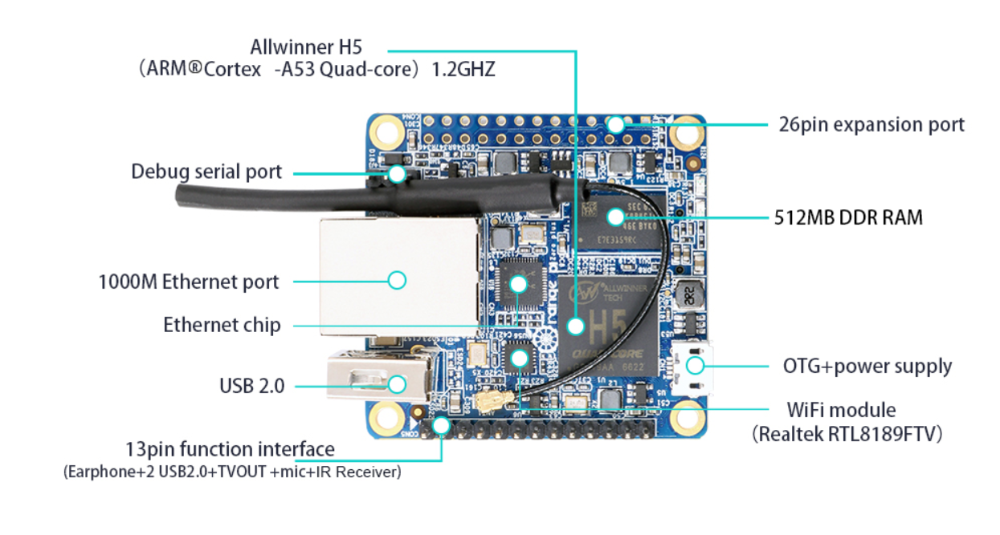]()  
**Specifications** 
**Cost and Sourcing Link**: USD 14.90. [Buy here](https://www.aliexpress.com/item/Orange-Pi-Zero-Plus-H5-Chip-Quad-Core-Open-source-Cortex-A53-512MB-development-board-beyond/32828347476.html?af=2513170&aff_platform=default&cpt=1556024489689&afref=http%253A%252F%252Fwww.orangepi.org%252FOrangePiZeroPlus&cn=42pqf06gq0bp8pz0zag9aa989ldajakp&dp=v5_42pqf06gq0bp8pz0zag9aa989ldajakp&cv=30181444&pvid=775ec9c5-8b64-4fdc-98be-33039f22dfd8&sk=ccfBY4yg&aff_trace_key=507bcc5540ca4f1f9d04253b27421d93-1556024489689-03528-ccfBY4yg&rmsg=no_replacement_pid_sid_whitelist&scm=1007.23534.124000.0&terminal_id=445918e391384fc1af7392745dc2a3f3) 
**CPU**: H5 Quad-core 64-bit Cortex-A53  
**GPU**: Hexa-core Mali450  
**RAM**: 512MB DDR3 (shared with GPU)  
**ROM**: NA  
**WiFi**: On-board with antenna  
**Memory Expansion**: Micro SD Card (Max. 32GB)  
**Ports**: 1 USB 2.0 Host, 1 USB OTG, Ethernet, 13 GPIOs  
**Power**: 5 W  
**OS**: Ubuntu, Android  
**Dimensions**: 45 mm x 48 mm  
**Weight**: 26 g   
**Supported Libraries**:  
TensorFlow: &#9745;  
OpenCV 3.3: &#9745;  
ROS: &#9745;  
Webcam Support: &#9745;  
**Benchmarks if available**: NA  
**Additional Notes**:  

<a name="raspberrypi"/>

###### [Raspberry Pi 3B+](https://www.raspberrypi.org/products/raspberry-pi-3-model-b-plus/)  
[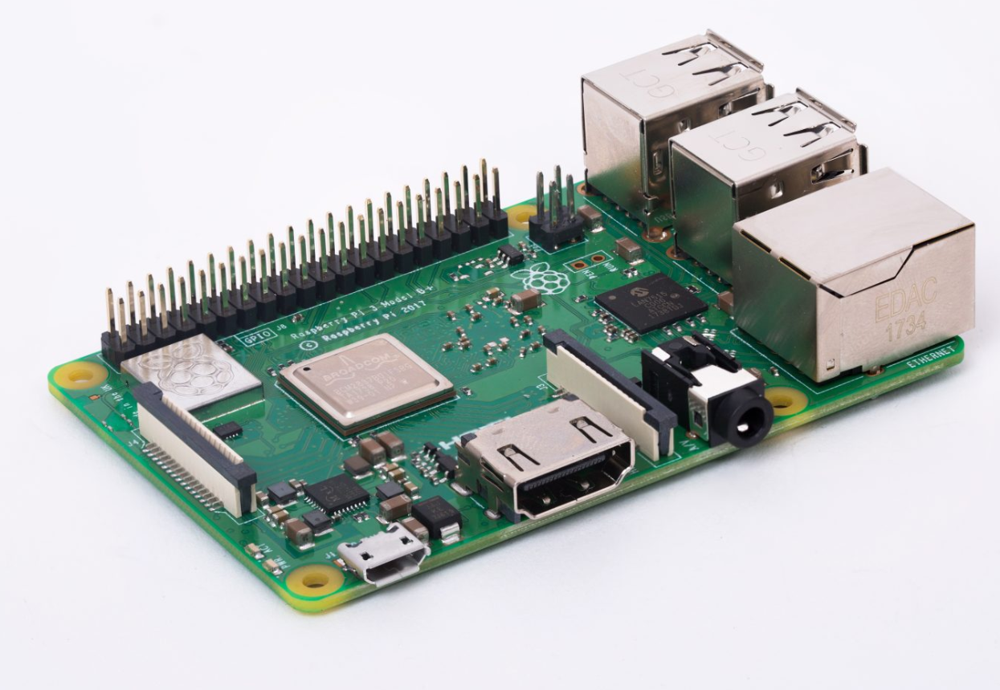]()  
**Specifications** 
**Cost and Sourcing Link**: USD 35.00. [Buy here](https://www.adafruit.com/product/3775?src=raspberrypi) 
**CPU**: Broadcom BCM2837B0, Cortex-A53 (ARMv8) 64-bit SoC at 1.4GHz  
**GPU**: NA  
**RAM**: 1GB  
**ROM**: NA  
**WiFi**: On-board with antenna  
**Memory Expansion**: Micro SD Card (Max. 32GB)  
**Ports**: 4 USB 2.0, Ethernet, HDMI, CSI, DSI, 40 GPIOs  
**Power**: 12.5 W  
**OS**: Ubuntu, Android  
**Dimensions**: 85 mm x 49 mm  
**Weight**: 42 g   
**Supported Libraries**:  
TensorFlow: &#9744;  
OpenCV 3.3: &#9744;  
ROS: &#9744;  
Webcam Support: &#9744;  
**Benchmarks if available**: NA  
**Additional Notes**:  

<a name="pizerow"/>

###### [Raspberry Pi Zero W](https://www.raspberrypi.org/products/raspberry-pi-zero-w/)  
[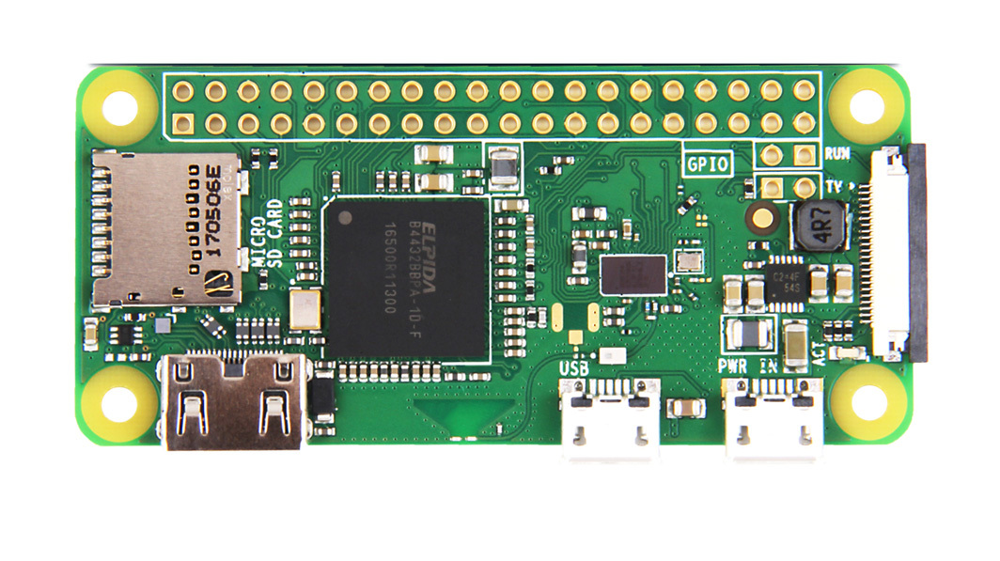]()  
**Specifications** 
**Cost and Sourcing Link**: USD 10.00. [Buy here](https://www.adafruit.com/product/3400) 
**CPU**: Broadcom BCM2835, ARM 11 SoC at 1.0GHz  
**GPU**: NA  
**RAM**: 512MB  
**ROM**: NA  
**WiFi**: On-board  
**Memory Expansion**: Micro SD Card (Max. 32GB)  
**Ports**: 1 micro-USB 2.0, mini-HDMI, CSI, 40 GPIOs  
**Power**: 1.5 W  
**OS**: Ubuntu  
**Dimensions**: 65 mm x 30 mm c 5 mm  
**Weight**: 9.3 g   
**Supported Libraries**:  
TensorFlow: &#9744;  
OpenCV 3.3: &#9744;  
ROS: &#9744;  
Webcam Support: &#9744;  
**Benchmarks if available**: NA  
**Additional Notes**:  

<a name="bananapim2zero"/>

###### [Banana Pi M2 Zero](http://www.banana-pi.org/bpi-zero.html)  
[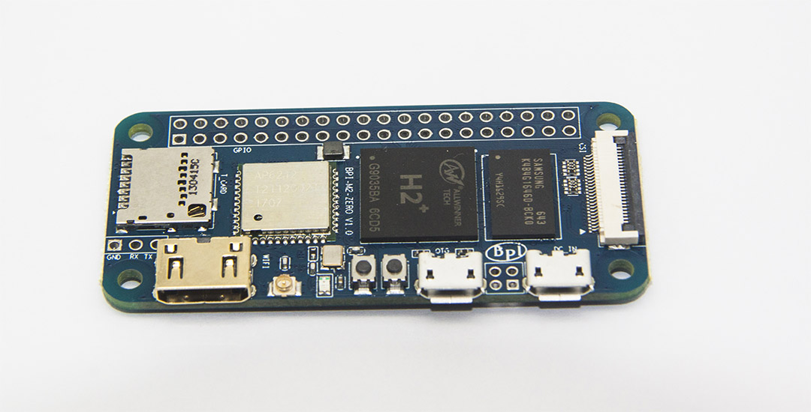]()  
**Specifications** 
**Cost and Sourcing Link**: USD 18.00. [Buy here](https://www.aliexpress.com/store/product/Allwinner-H2-Open-source-hardware-platform-BPI-M2-zero-all-ineter-face-same-as-Raspberry-pi/302756_32839074880.html?spm=2114.12010612.8148356.3.3d09623bPs2SRG) 
**CPU**: H2+ Quad-core 64-bit Cortex-A7  
**GPU**: Mali-400 MP2  
**RAM**: 512MB DDR3 (shared with GPU)  
**ROM**: NA  
**WiFi**: On-board with antenna  
**Memory Expansion**: Micro SD Card (Max. 64GB)  
**Ports**: Mini-HDMI, USB OTG 2.0, CSI  
**Power**: 10 W  
**OS**: Ubuntu  
**Dimensions**: 60 mm x 30 mm  
**Weight**: 35 g   
**Supported Libraries**:  
TensorFlow: &#9744;  
OpenCV 3.3: &#9744;  
ROS: &#9744;  
Webcam Support: &#9744;  
**Benchmarks if available**: NA  
**Additional Notes**:  

<a name="tx2"/>

###### [NVIDIA Jetson TX2](https://developer.nvidia.com/embedded/buy/jetson-tx2)  
  
**Specifications** 
**Cost and Sourcing Link**: USD 299.00 with Academic Discount. [Buy here](http://www.nvidia.com/object/jetsontx2-edu-discount.html) 
**CPU**: Dual-core Denver 2 64-bit CPU and quad-core ARM A57 complex  
**GPU**: 256 NVIDIA Pascal Cuda Cores  
**RAM**: 8GB  
**ROM**: 32GB  
**WiFi**: On-board with antenna  
**Memory Expansion**: Micro SD Card (Max. 32GB)  
**Ports**: 4 USB 2.0, Ethernet, HDMI, CSI, 40 GPIOs  
**Power**: 15 W  
**OS**: Ubuntu  
**Dimensions**: 87 mm x 50 mm  
**Weight**: 120 g?   
**Supported Libraries**:  
TensorFlow: &#9745;  
OpenCV 3.3: &#9745;  
ROS: &#9745;  
Webcam Support: &#9745;  
**Benchmarks if available**: NA  
**Additional Notes**: Use [this Connect Tech carrier board](http://connecttech.com/product/sprocket-carrier-nvidia-jetson-tx2-jetson-tx1/)  

<a name="xavier"/>

###### [NVIDIA Jetson Xavier](https://developer.nvidia.com/embedded/buy/jetson-agx-xavier-devkit)  
[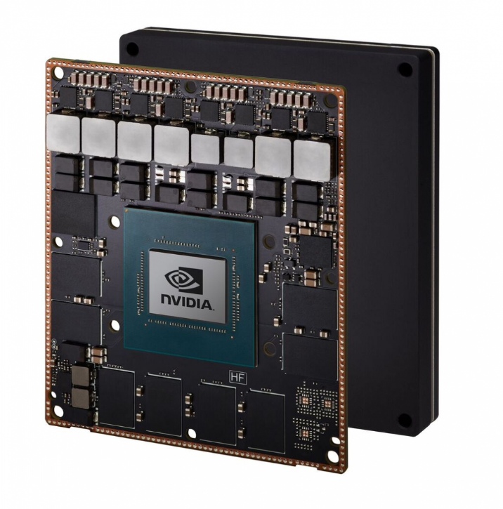]()  
**Specifications** 
**Cost and Sourcing Link**: USD 899.00 with Academic Discount. [Buy here](https://www.nvidia.com/object/jetson-agx-xavier-edu-discount.html) 
**CPU**: 8-core ARM v8.2 64-bit CPU, 8MB L2 + 4MB L3  
**GPU**: 512-core Volta GPU and 64 Tensor Cores  
**RAM**: 16GB  
**ROM**: 32GB  
**WiFi**: On-board with antenna  
**Memory Expansion**: Micro SD Card (Max. 32GB)  
**Ports**: 4 USB 2.0, Ethernet, HDMI, CSI, 40 GPIOs  
**Power**: 15 W  
**OS**: Ubuntu  
**Dimensions**: 105 mm x 105 mm  
**Weight**: 670 g?   
**Supported Libraries**:  
TensorFlow: &#9744;  
OpenCV 3.3: &#9744;  
ROS: &#9744;  
Webcam Support: &#9744;  
**Benchmarks if available**: NA  
**Additional Notes**: Use [this Connect Tech carrier board](http://connecttech.com/product-category/form-factors/nvidia-jetson-agx-xavier/)  

<a name="jetsonnano"/>

###### [NVIDIA Jetson Nano](https://www.nvidia.com/en-us/autonomous-machines/embedded-systems/jetson-nano/)  
[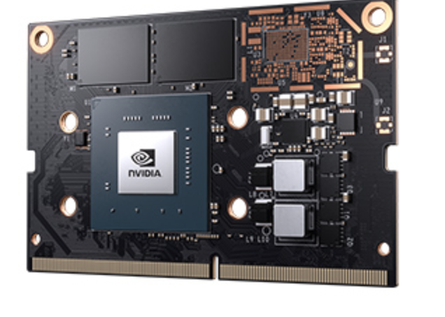]()  
**Specifications** 
**Cost and Sourcing Link**: USD 99.00. [Buy here](https://store.nvidia.com/store?Action=DisplayPage&Env=BASE&Locale=en_US&SiteID=nvidia&id=QuickBuyCartPage) 
**CPU**: Quad-core ARM A57 at 1.43 GHz  
**GPU**: 128 NVIDIA Maxwell Cuda Cores  
**RAM**: 4GB  
**ROM**: NA  
**WiFi**: On-board with antenna  
**Memory Expansion**: Micro SD Card (Max. 32GB)  
**Ports**: 4 USB 3.0, USB 2.0 Micro-B, Ethernet, HDMI, CSI, 40 GPIOs  
**Power**: 15 W  
**OS**: Ubuntu  
**Dimensions**: 87 mm x 59 mm  
**Weight**: 50 g   
**Supported Libraries**:  
TensorFlow: &#9744;  
OpenCV 3.3: &#9744;  
ROS: &#9744;  
Webcam Support: &#9744;  
**Benchmarks if available**: NA  
**Additional Notes**:  

<a name="imx7"/>

###### [iMX7](https://www.e-consystems.com/iMX7-som-system-on-module.asp)  
[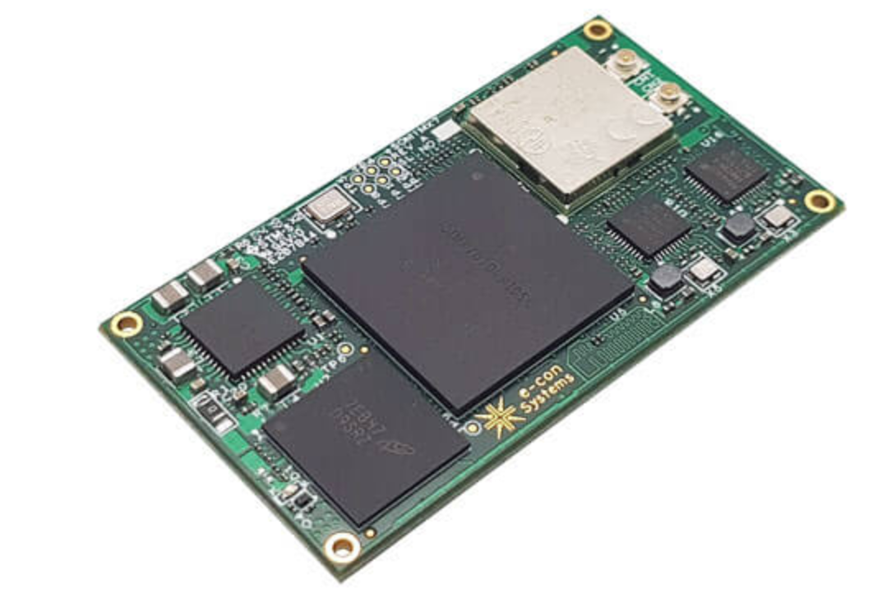]()  
**Specifications** 
**Cost and Sourcing Link**: USD 299.00. [Buy here](https://www.e-consystems.com/webstore.asp#AnkaaPLUSprice) 
**CPU**: NXP ARM Cortex A7 iMX7 at 1 GHz  
**GPU**: NA  
**RAM**: 2GB  
**ROM**: 4GB  
**WiFi**: On-board with antenna  
**Memory Expansion**: Micro SD Card (Max. 64GB)  
**Ports**: 2 USB 2.0, Ethernet, HDMI, CSI, some GPIOs  
**Power**: NA  
**OS**: Yocto Linux  
**Dimensions**: 105 mm x 80 mm  
**Weight**: NA   
**Supported Libraries**:  
TensorFlow: &#9744;  
OpenCV 3.3: &#9744;  
ROS: &#9744;  
Webcam Support: &#9744;  
**Benchmarks if available**: NA  
**Additional Notes**:  

<a name="imx6"/>

###### [iMX6PLUS](https://www.e-consystems.com/iMX6-quad-plus-dual-plus-core-som-system-on-module.asp)  
[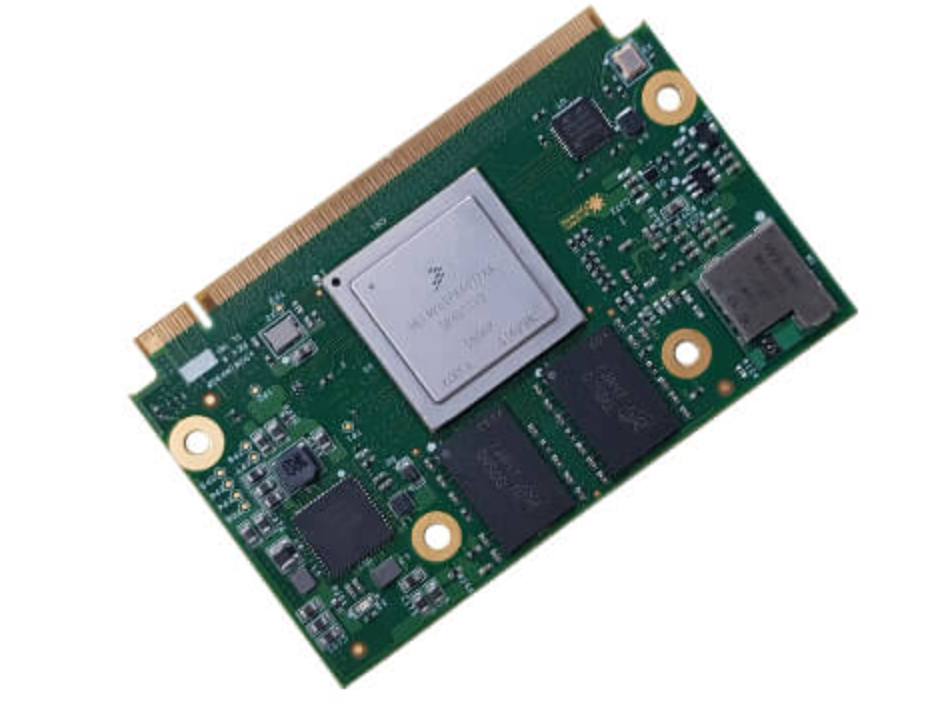]()  
**Specifications** 
**Cost and Sourcing Link**: USD 349.00. [Buy here](https://www.e-consystems.com/webstore.asp#AnkaaPLUSprice) 
**CPU**: NXP ARM Cortex A9 iMX6 at 1.2 GHz  
**GPU**: NA  
**RAM**: 2GB  
**ROM**: 8GB  
**WiFi**: On-board with antenna  
**Memory Expansion**: Micro SD Card (Max. 64GB)  
**Ports**: 2 USB 2.0, Ethernet, HDMI, CSI, some GPIOs  
**Power**: NA  
**OS**: Yocto Linux  
**Dimensions**: 70 mm x 45 mm  
**Weight**: NA   
**Supported Libraries**:  
TensorFlow: &#9744;  
OpenCV 3.3: &#9744;  
ROS: &#9744;  
Webcam Support: &#9744;  
**Benchmarks if available**: NA  
**Additional Notes**: [Ubuntu on iMX6 Boards](https://community.nxp.com/docs/DOC-330147).  

<a name="rockpi"/>

###### [RockPi 4B](http://rockpi.org/)  
[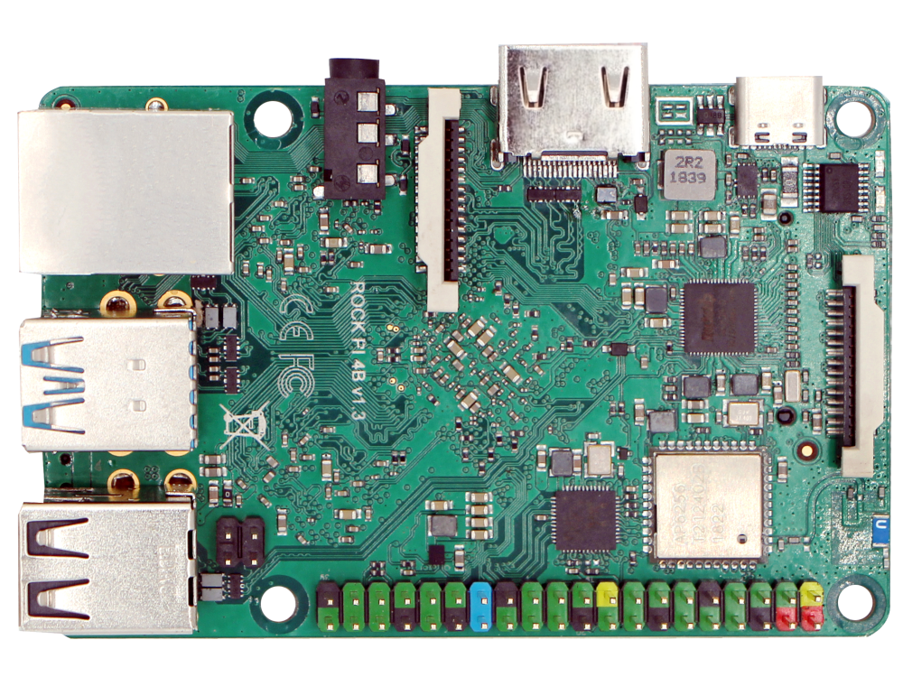]()  
**Specifications** 
**Cost and Sourcing Link**: USD 74.95. [Buy here](https://shop.allnetchina.cn/) 
**CPU**: Dual Cortex-A72 at 1.8GHz and quad Cortex-A53 at 1.4GHz  
**GPU**: Mali T860  
**RAM**: 512MB DDR3 (shared with GPU)  
**ROM**: 64GB  
**WiFi**: On-board 
**Memory Expansion**: Micro SD Card (Max. 128GB), M2 NVME SSD (Max. 1TB)  
**Ports**: 1 USB 3.0 Host, 1 USB 3.0 OTG, 2 USB 2.0 Host, Ethernet, 6 GPIOs  
**Power**: NA  
**OS**: Linaro Linux, Android  
**Dimensions**: 85 mm x 54 mm  
**Weight**: NA   
**Supported Libraries**:  
TensorFlow: &#9745;  
OpenCV 3.3: &#9745;  
ROS: &#9745;  
Webcam Support: &#9745;  
**Benchmarks if available**: NA  
**Additional Notes**:  

<a name="a33olinixino"/>

###### [A33-OLinuXino](https://www.olimex.com/Products/OLinuXino/A33/A33-OLinuXino/open-source-hardware)  
[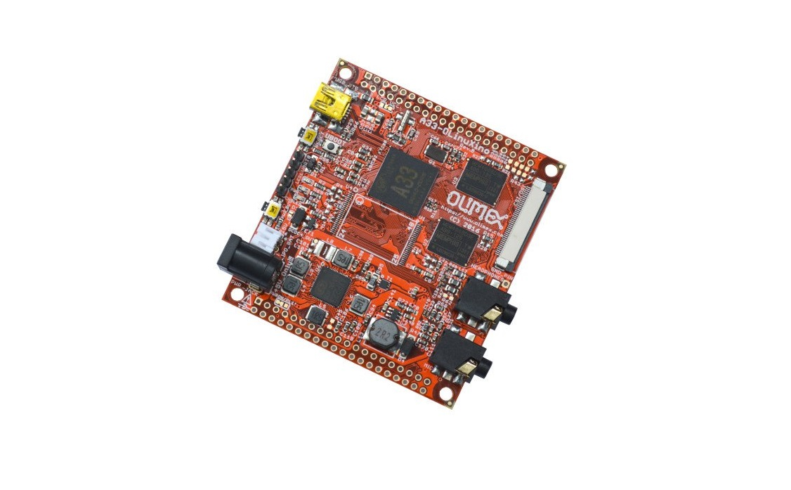]()  
**Specifications** 
**Cost and Sourcing Link**: USD 32.40. [Buy here](https://www.olimex.com/Products/OLinuXino/A33/A33-OLinuXino/open-source-hardware) 
**CPU**: A33 Quad Core A7 at 1.2GHz  
**GPU**: Mali-400  
**RAM**: 1GB DDR3  
**ROM**: ?  
**WiFi**: NA  
**Memory Expansion**: NA  
**Ports**: CSI, DSI, GPIOs  
**Power**: NA  
**OS**: Linux, Android  
**Dimensions**: 66 mm x 71 mm  
**Weight**: 20 g   
**Supported Libraries**:  
TensorFlow: &#9744;  
OpenCV 3.3: &#9744;  
ROS: &#9744;  
Webcam Support: &#9744;  
**Benchmarks if available**: NA  
**Additional Notes**:  

<a name="x86cpus"/>

### x86 computers  

<a name="nuc"/>

###### [Intel NUC 7I7DNBE](https://www.intel.in/content/www/in/en/products/boards-kits/nuc/boards/nuc7i7dnbe.html)  
[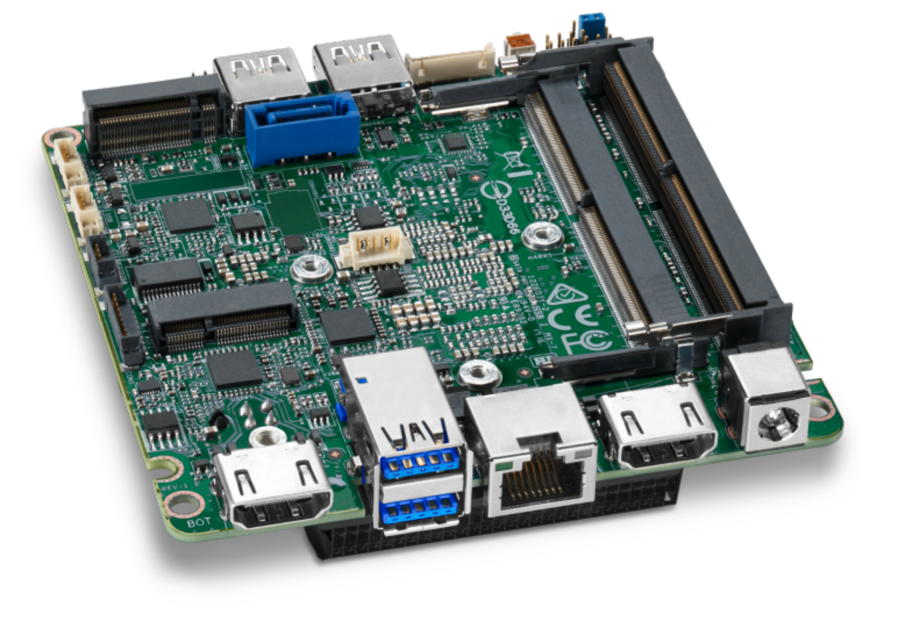]()  
**Specifications** 
**Cost and Sourcing Link**: USD 1099.95 with 32 GB RAM, 512 GB SSD. [Buy here](https://simplynuc.com/7i7dnbe-board-full/) 
**CPU**: Intel Core i7  
**GPU**: Intel HD Graphics  
**RAM**: 32GB (Max.)  
**ROM**: M2 Slot (Max. 1 TB)  
**WiFi**: On-board with antenna  
**Memory Expansion**: M2 Slot (Max. 1 TB)  
**Ports**: 4 USB 3.0, 1 USB 3.0 and 1 USB 2.0 via internal headers, Ethernet, HDMI, CSI, 40 GPIOs  
**Power**: 15 W  
**OS**: Ubuntu, Windows  
**Dimensions**: 101 mm x 101 mm  
**Weight**: 120 g?   
**Supported Libraries**:  
TensorFlow: &#9744;  
OpenCV 3.3: &#9744;  
ROS: &#9744;  
Webcam Support: &#9744;  
**Benchmarks if available**: NA  
**Additional Notes**:  

<a name="upsquared"/>

###### [Intel Up Squared AI Vision X](https://software.intel.com/en-us/iot/hardware/up-squared-ai-vision-dev-kit)  
[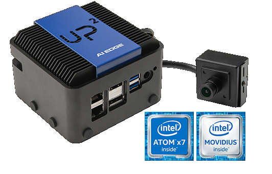]()  
**Specifications** 
**Cost and Sourcing Link**: USD 519.00 with 32 GB RAM, 512 GB SSD. [Buy here](https://up-shop.org/home/285-up-squared-ai-vision-x-developer-kit.html#/116-up_squared_ai_vision_x_developer_kit-version_b_w_myriad_x) 
**CPU**: Intel Atom x7-E3950 processor (1.6 GHz quad core, burst up to 2.0 GHz)  
**GPU**: Integrated Intel HD Graphics 505 and Movidius Myriad X  
**RAM**: 8GB  
**ROM**: 64GB  
**WiFi**: With [WiFi card](https://up-shop.org/up-peripherals/153-m2-2230-wifi-kit-for-up-squared-metal-chassis.html)  
**Memory Expansion**: NA  
**Ports**: 4 USB 2.0, Ethernet, HDMI, CSI, 40 GPIOs  
**Power**: 15 W  
**OS**: Ubuntu, Windows  
**Dimensions**: 101 mm x 101 mm  
**Weight**: 120 g?   
**Supported Libraries**:  
TensorFlow: &#9744;  
OpenCV 3.3: &#9744;  
ROS: &#9744;  
Webcam Support: &#9744;  
**Benchmarks if available**: NA  
**Additional Notes**:  

<a name="aaeonup"/>

###### [AAeon Up Board](https://store.intelrealsense.com/buy-aaeon-up-board.html)  
[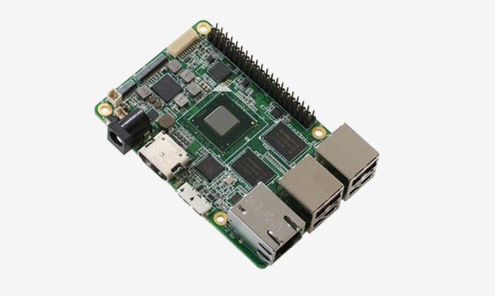]()  
**Specifications** 
**Cost and Sourcing Link**: USD 89.00. [Buy here](https://store.intelrealsense.com/buy-aaeon-up-board.html) 
**CPU**: Intel Atom x5-Z8350 Processor (1.44 GHz quad core, burst up to 1.92 GHz)  
**GPU**: Integrated Intel HD Graphics 400  
**RAM**: 4GB  
**ROM**: 32GB  
**WiFi**: With [WiFi card](https://up-shop.org/up-peripherals/153-m2-2230-wifi-kit-for-up-squared-metal-chassis.html)  
**Memory Expansion**: NA  
**Ports**: 1 USB 3.0 OTG, 4 USB 2.0, 2 USB 2.0 header, Ethernet, HDMI, CSI, DSI, 40 GPIOs  
**Power**: 15 W  
**OS**: Ubuntu 14.04, 16.04  
**Dimensions**: 85.60 mm x 56.5 mm  
**Weight**: 120 g?   
**Supported Libraries**:  
TensorFlow: &#9744;  
OpenCV 3.3: &#9744;  
ROS: &#9744;  
Webcam Support: &#9744;  
**Benchmarks if available**: NA  
**Additional Notes**:  

<a name="lattepanda"/>

###### [LattePanda](https://www.lattepanda.com/products/3.html)  
[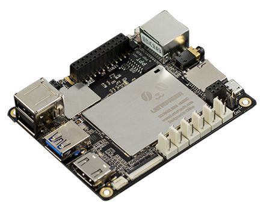]()  
**Specifications** 
**Cost and Sourcing Link**: USD 149.00. [Buy here](https://www.dfrobot.com/index.php?route=product/search&description=true&search=LattePanda) 
**CPU**: Intel Cherry Trail Z8350 Quad Core 1.8GHz  
**GPU**: Integrated Intel HD Graphics  
**RAM**: 4GB  
**ROM**: 64GB  
**WiFi**: On-board WiFi  
**Memory Expansion**: NA  
**Ports**: 1 USB 3.0, 2 USB 2.0,Ethernet, HDMI, DSI, 6 GPIOs, 20 GPIOs from Arduino Leonardo  
**Power**: 15 W  
**OS**: Windows, Ubuntu  
**Dimensions**: 88 mm x 70 mm  
**Weight**: 55 g   
**Supported Libraries**:  
TensorFlow: &#9744;  
OpenCV 3.3: &#9744;  
ROS: &#9744;  
Webcam Support: &#9744;  
**Benchmarks if available**: NA  
**Additional Notes**:  

<a name="nnacc"/>

### Neural Network Accelerators  

<a name="ncs2"/>

###### [Intel Neural Compute Stick 2](https://software.intel.com/en-us/neural-compute-stick)  
[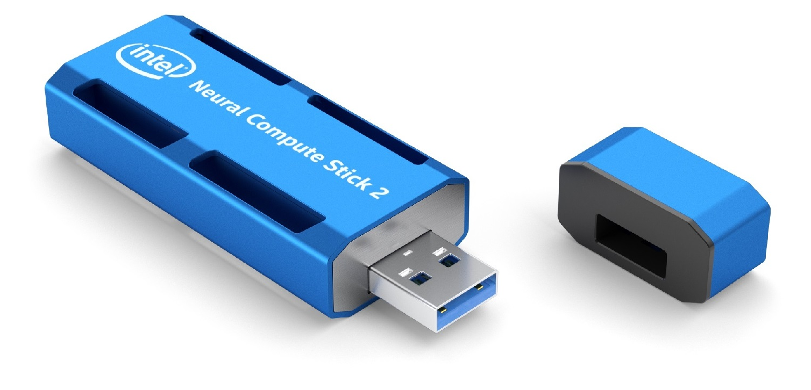]()  
**Specifications** 
**Cost and Sourcing Link**: USD 99.00. [Buy here](https://www.mouser.com/ProductDetail/Intel/NCSM2485DK?qs=byeeYqUIh0OB4GXNqgW8aw%3D%3D) 
**GPU/VPU**: Intel Myriad X with 16 SHAVE Cores  
**Interface**: USB 3.0.  
**FLOPs**: 100 GFLOPs 
**Power**: 1 W  
**Supoorted OS**: Ubuntu  
**Dimensions**: 72.5 mm x 27 mm x 14 mm 
**Weight**: 18.1 g   
**Supported Libraries**:  
TensorFlow: &#9745;  
Caffe: &#9745;  
**Benchmarks if available**: NA  
**Additional Notes**: Generally tuned for classification tasks. Regression tasks have limited support.  

<a name="coral"/>

###### [Google Coral USB Accelerator](https://coral.withgoogle.com/products/accelerator)  
  
**Specifications** 
**Cost and Sourcing Link**: USD 74.99. [Buy here](https://www.mouser.com/ProductDetail/Coral/G950-01456-01?qs=sGAEpiMZZMve4%2FbfQkoj%252BNzzHFZgWGqIphwvwTL5xvk%3D) 
**GPU/VPU**: Google Edge TPU  
**Interface**: USB 3.1.  
**FLOPs**: NA  
**Power**: 2.5 W  
**Supported OS**: Ubuntu  
**Dimensions**: 65 mm x 30 mm x 8 mm 
**Weight**: NA   
**Supported Libraries**:  
TensorFlow: &#9745;  
Caffe: &#9744;  
**Benchmarks if available**: NA  
**Additional Notes**: Supports only TensorFlow Lite models.  

<a name="orangepiaistick"/>

###### [OrangePi AI Stick 2801](http://www.orangepi.org/Orange%20Pi%20AI%20Stick%202801/)  
[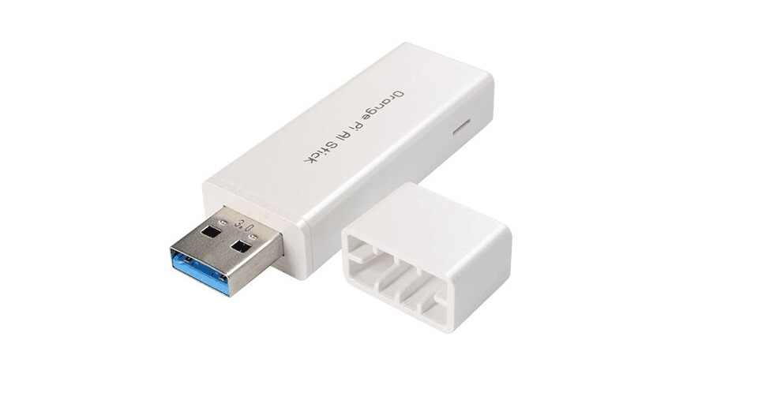]()  
**Specifications** 
**Cost and Sourcing Link**: USD 69.00. [Buy here](https://www.aliexpress.com/item/Orange-Pi-AI-Stick-2801-Neural-Network-Computing-Stick-Artificial-Intelligence/32954041998.html) 
**GPU/VPU**: Lightspeeur SPR2801S  
**Interface**: USB 3.0.  
**FLOPs**: 9.3 TFLOPs  
**Power**: 1.0 W  
**Supported OS**: Ubuntu  
**Dimensions**: 66.5 mm x 20.5 mm x 10.8 mm 
**Weight**: NA   
**Supported Libraries**:  
TensorFlow: &#9744;  
Caffe: &#9745;  
PyTorch: &#9745;  
**Benchmarks if available**: NA  
**Additional Notes**: Buy Plai full stack development framework based on PyTorch for USD 149.00 separately. Other related products can be found [here](http://wiki.t-firefly.com/en/NCCS1/plai.html).  

<a name="sensors"/>

## Sensors

<a name="cameras"/>

### Cameras

<a name="imagcameras"/>

#### Imaging Cameras 

<a name="globimagcameras"/>

##### Global Shutter Cameras 

<a name="openmvh7"/>

###### [OpenMV Cam H7](https://openmv.io/products/openmv-cam-h7)  
[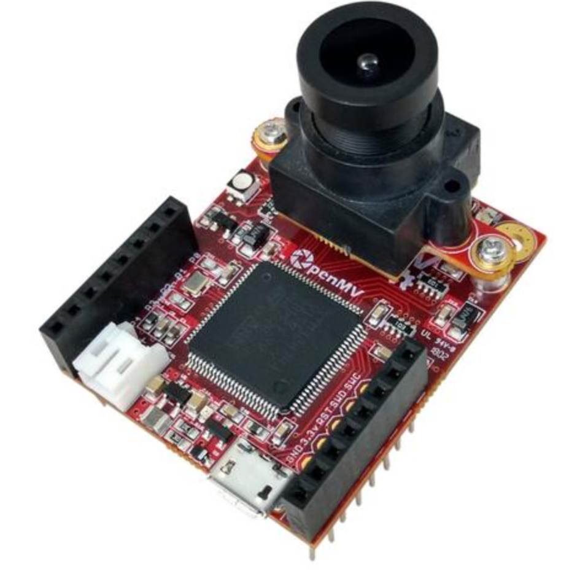]()  
**Specifications** 
**Cost and Sourcing Link**: USD 65.00. [Buy here](https://openmv.io/products/openmv-cam-h7) 
**Sensor**: ON Semiconductor MT9V034 with optional [Global Shutter upgrade](https://openmv.io/collections/cams/products/global-shutter-camera-module)  
**Shutter Type**: Global with upgrade   
**Resolution and Frame rate**: 752 x 480 at 60 fps (Max.)   
**Sensor Size**: 1/3"  
**Color/Monochrome**: RGB Color  
**Lens Mount**: M12  
**Dimensions**: 45 mm x 36 mm x 30 mm 
**Weight**: 19 g   
**Additional Notes**: Comes with a Cortex M7 processor on-board at 400MHz, 256KB RAM and Micro SD Card support. Also supports MicroPython programming interface. 

<a name="jevois"/>

###### [JeVois Smart Machine Vision Camera](https://www.jevoisinc.com/)  
[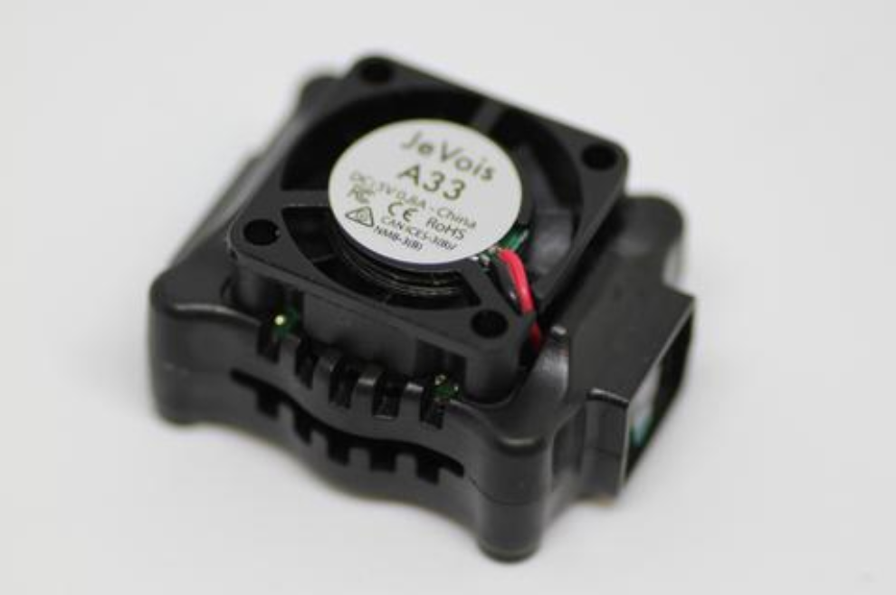]()  
**Specifications** 
**Cost and Sourcing Link**: USD 49.99. [Buy here](https://www.jevoisinc.com/products/jevois-a33-smart-machine-vision-camera?variant=36249051018) 
**Sensor**: Omnivision OV9653 with optional [OnSemi AR0135 Global Shutter upgrade with InvenSense IMU ICM-20948](https://www.jevoisinc.com/products/jevois-1-2mp-global-shutter-sensor-with-9-dof-imu-upgrade-kit-color)  
**Shutter Type**: Rolling or Global with upgrade   
**Resolution and Frame rate**:  1280 x 1024  at 15 fps (Max.)   
**Sensor Size**: 1/3"  
**Color/Monochrome**: RGB Color  
**Lens Mount**: 1/4"  
**Dimensions**: 39 mm x 31 mm x 23 mm 
**Weight**: 17 g (including 5.4 g plastic case and 4.1 g cooling fan)   
**Additional Notes**: Comes with a Quad-core ARM Cortex A7 at 1.35 GHz, Dual core Mali 400 GPU, 256 MB RAM and can run vision algorithms on-board. 

<a name="see3cam11cug"/>

###### [See3CAM_11CUG](https://www.e-consystems.com/industrial-digital-camera.asp)  
[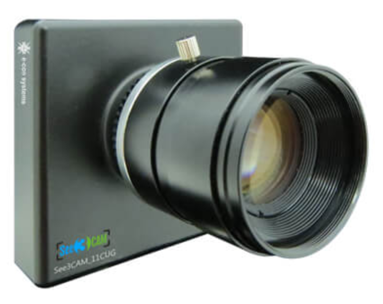]()  
**Specifications** 
**Cost and Sourcing Link**: USD 199.00. [Buy here](https://www.e-consystems.com/webstore.asp#See3CAM_11CUG) 
**Sensor**: ON Semiconductor AR0134CS  
**Shutter Type**: Global with upgrade   
**Resolution and Frame rate**: 1280 x 960 at 20 fps (Max.) Sensor supports upto 60 fps at Max. resolution.  
**Sensor Size**: 1/3"  
**Color/Monochrome**: RGB Color  
**Lens Mount**: C/CS  
**Dimensions**: 40 mm x 44 mm  
**Weight**: 25 g (without lens and without enclosure)   
**Additional Notes**:  

<a name="mvbluefox"/>

###### [Matrix Vision mvBlueFox-MLC200wC](https://www.matrix-vision.com/USB3-vision-camera-mvbluefox3.html)  
[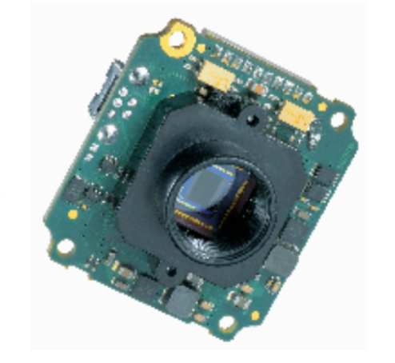]()  
**Specifications** 
**Cost and Sourcing Link**: USD 999.00. [Buy here](https://www.matrix-vision.com/USB2.0-single-board-camera-mvbluefox-mlc.html?camera=mvBlueFOX-MLC200wC&selectInterface=Alle&selectMpixels=Alle&selectFps=Alle&selectSensor=Alle&selectColor=Alle&selectSize=Alle&selectShutter=Alle&selectModel=Alle&col=1&row=0&file=tl_files/mv11/support/mvIMPACT_Acquire/01/mvBlueFOX-x86-2.21.0.msi) 
**Sensor**: ON Semiconductor MT9V  
**Shutter Type**: Global   
**Resolution and Frame rate**: 752 x 480 at 93 fps (Max.)  
**Sensor Size**: 1/3"  
**Color/Monochrome**: RGB Color  
**Lens Mount**: C/CS  
**Dimensions**: 35 mm x 33 mm x 25 mm  
**Weight**: 10 g (without lens and without enclosure)   
**Additional Notes**:  

<a name="pointgreyflea3"/>

###### [Point Grey Flea3 e2v EV76C560](https://www.ptgrey.com/flea3-13-mp-color-usb3-vision-e2v-ev76c560-camera)  
[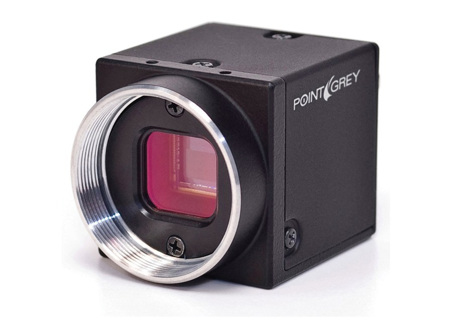]()  
**Specifications** 
**Cost and Sourcing Link**: USD 695.00. [Buy here](https://www.ptgrey.com/flea3-13-mp-color-usb3-vision-e2v-ev76c560-camera) 
**Sensor**: e2v EV76C560
  
**Shutter Type**: Global   
**Resolution and Frame rate**: 1280 x 1024 at 60 fps (Max.)  
**Sensor Size**: 1/1.8"  
**Color/Monochrome**: RGB Color  
**Lens Mount**: C  
**Dimensions**: 29 mm x 29 mm x 30 mm  
**Weight**: 41 g (without lens and without enclosure)   
**Additional Notes**:  

<a name="mynteye"/>

###### [Mynt Eye D](https://www.mynteye.com/pages/mynt-eye-d)  
[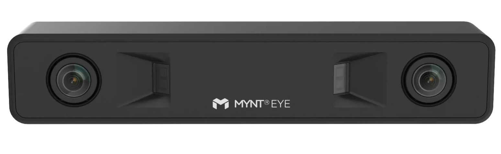]()  
**Specifications** 
**Cost and Sourcing Link**: USD 399.00. [Buy here](https://www.mynteye.com/products/mynt-eye-d-pre-order) 
**Sensor**: NA   
**Shutter Type**: Global   
**Resolution and Frame rate**: 2560 x 720 at 60 fps (Max.) and Depth at 1280 x 720 at 60 fps (Max.)  
**Baseline**: NA  
**Sensor Size**: NA  
**Color/Monochrome**: RGB Color  
**Lens Mount**: M12  
**Dimensions**: 145 mm x 20 mm x 28.6 mm 
**Weight**: 190 (with casing), 80 g (without casing)   
**Additional Notes**: Includes an IMU as well.  

<a name="tara"/>

###### [Tara](https://www.e-consystems.com/3D-USB-stereo-camera.asp)  
[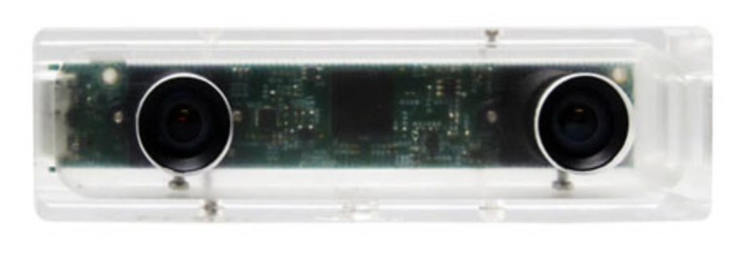]()  
**Specifications** 
**Cost and Sourcing Link**: USD 299.00. [Buy here](https://www.e-consystems.com/webstore.asp#tara_Stereo_Vision_camera) 
**Sensor**: MT9V024  
**Shutter Type**: Global   
**Resolution and Frame rate**: 1504 x 480 at 60 fps (Max.)  
**Baseline**: 60 mm  
**Sensor Size**: 1/3"  
**Color/Monochrome**: RGB Color  
**Lens Mount**: M12  
**Dimensions**: 145 mm x 20 mm x 28.6 mm 
**Weight**: 80.5 (with casing), 28.5 g (without casing)   
**Additional Notes**: Includes an IMU as well.  

<a name="duomlx"/>

###### [Duo MLX](https://duo3d.com/product/duo-minilx-lv1)  
[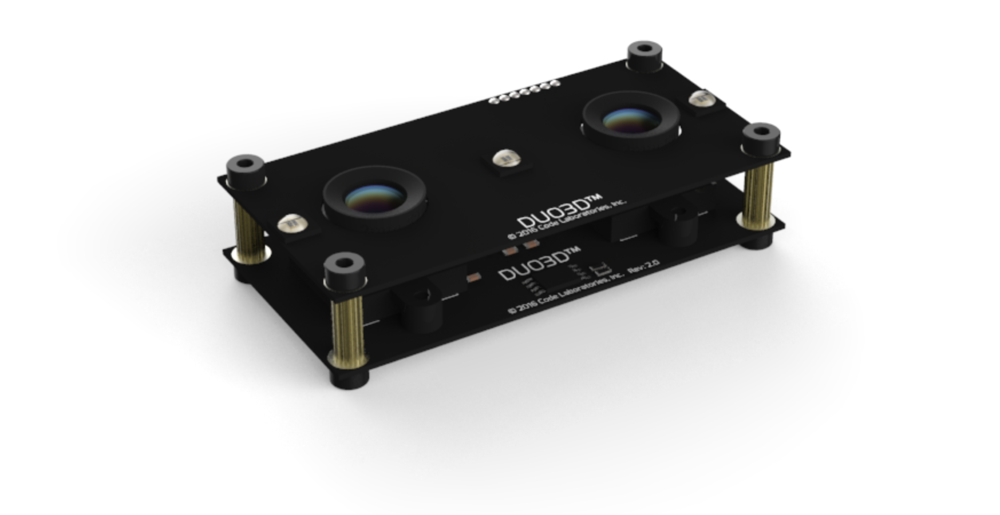]()  
**Specifications** 
**Cost and Sourcing Link**: USD 695.00. [Buy here](https://duo3d.com/account) 
**Sensor**: NA  
**Shutter Type**: Global   
**Resolution and Frame rate**: 1504 x 480 at 45 fps (Max.)  
**Baseline**: 30 mm  
**Sensor Size**: 1/3"  
**Color/Monochrome**: RGB Color  
**Lens Mount**: M8  
**Dimensions**: 52 mm x 25 mm x 13 mm 
**Weight**: 12.5 g   
**Additional Notes**: Includes an IMU as well.  

<a name="zed"/>

###### [Zed](https://www.stereolabs.com/zed/)  
[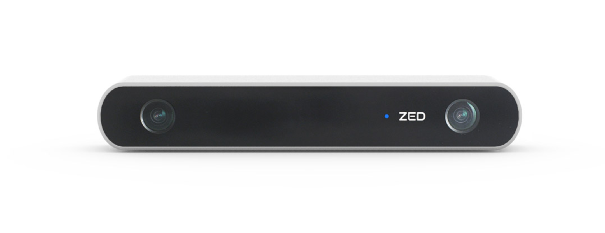]()  
**Specifications** 
**Cost and Sourcing Link**: USD 449.00. [Buy here](https://store.stereolabs.com/products/zed) 
**Sensor**: NA  
**Shutter Type**: Rolling   
**Resolution and Frame rate**: 4416 x 1242 at 15 fps (Max.)  
**Baseline**: 120 mm  
**Sensor Size**: 1/3" BSI  
**Color/Monochrome**: RGB Color  
**Lens Mount**: M8  
**Dimensions**: 175 mm x 30 mm x 33 mm 
**Weight**: 159 g   
**Additional Notes**: Has Real time VIO at 100 Hz with position accuracy of 1 mm and orientation accuracy of 0.1 degrees.  

<a name="zedmini"/>

###### [Zed Mini](https://www.stereolabs.com/zed-mini/)  
[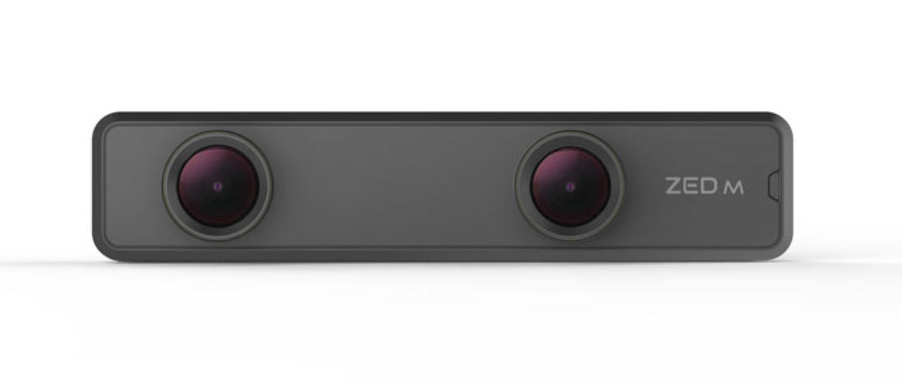]()  
**Specifications** 
**Cost and Sourcing Link**: USD 449.00. [Buy here](https://store.stereolabs.com/products/zed-mini/?_ga=2.206780435.1291925988.1556141046-637591444.1556141046) 
**Sensor**: NA  
**Shutter Type**: Rolling   
**Resolution and Frame rate**: 4416 x 1242 at 15 fps (Max.)  
**Baseline**: 63 mm  
**Sensor Size**: 1/3" BSI  
**Color/Monochrome**: RGB Color  
**Lens Mount**: M8  
**Dimensions**: 124.5 mm x 30.5 mm x 26.5 mm 
**Weight**: 62.9 g   
**Additional Notes**: Has Real time VIO at 100 Hz with position accuracy of 1 mm and orientation accuracy of 0.1 degrees.  

<a name="rollingimagcameras"/>

##### Rolling Shutter Cameras 

<a name="elp"/>

###### [ELP USB Camera](https://www.amazon.com/dp/B012CH5F58/ref=sspa_dk_detail_0?psc=1&pd_rd_i=B012CH5F58&pd_rd_w=C08fx&pf_rd_p=8a8f3917-7900-4ce8-ad90-adf0d53c0985&pd_rd_wg=wmekN&pf_rd_r=9BRH4KPT0RXJG111XN4V&pd_rd_r=bd919c96-6379-11e9-afd4-2da01f345a74)  
[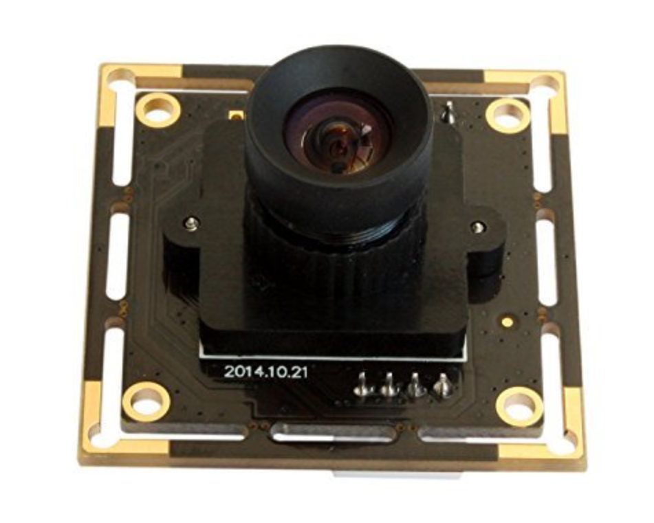]()  
**Specifications** 
**Cost and Sourcing Link**: USD 48.99. [Buy here](https://www.amazon.com/dp/B012CH5F58/ref=sspa_dk_detail_0?psc=1&pd_rd_i=B012CH5F58&pd_rd_w=C08fx&pf_rd_p=8a8f3917-7900-4ce8-ad90-adf0d53c0985&pd_rd_wg=wmekN&pf_rd_r=9BRH4KPT0RXJG111XN4V&pd_rd_r=bd919c96-6379-11e9-afd4-2da01f345a74) 
**Sensor**: Aptina MI5100   
**Shutter Type**: Rolling   
**Resolution and Frame rate**: 2592 x 1944 at 15 fps (Max.)  
**Sensor Size**: 1/2.5"  
**Color/Monochrome**: RGB Color  
**Lens Mount**: M12  
**Dimensions**: 38 mm x 38 mm  
**Weight**: 10 g (with lens)   
**Additional Notes**:  

<a name="picam2"/>

###### [Raspberry Pi Camera Module V2](https://www.raspberrypi.org/products/camera-module-v2/)  
[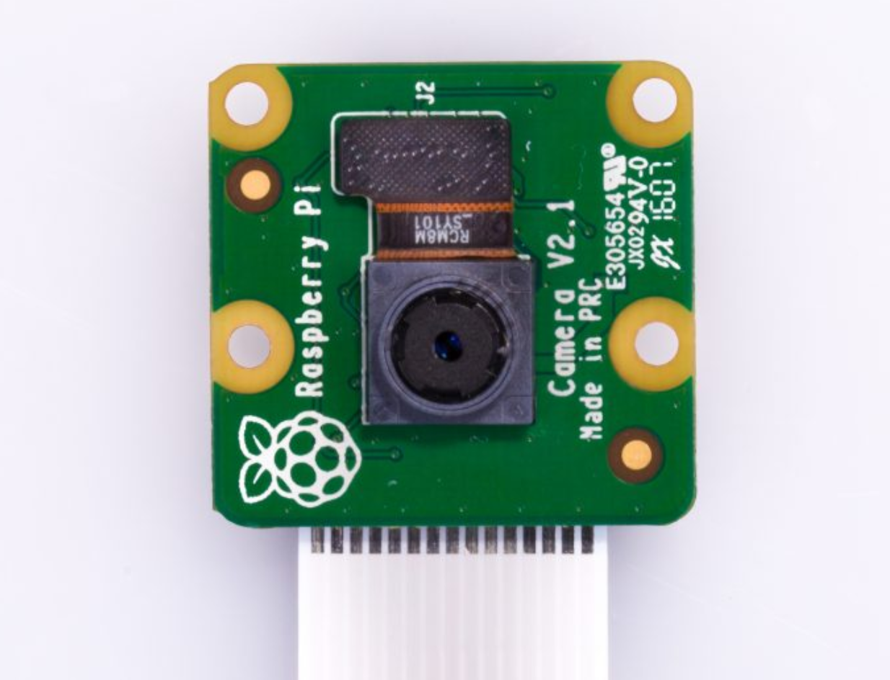]()  
**Specifications** 
**Cost and Sourcing Link**: USD 29.95. [Buy here](https://www.adafruit.com/product/3099?src=raspberrypi) 
**Sensor**: Sony IMX219   
**Shutter Type**: Rolling   
**Resolution and Frame rate**: 1920 x 1080 at 30 fps (Max.)  
**Sensor Size**: 1/4"  
**Color/Monochrome**: RGB Color  
**Lens Mount**: M12  
**Dimensions**: 25 mm x 24 mm x 9 mm  
**Weight**: 3 g (with lens)   
**Additional Notes**: Similar Modules can be found at [ArduCam](http://www.arducam.com/). [Rolling Shutter Problems](https://www.raspberrypi.org/forums/viewtopic.php?t=177046). Can order multi-camera to one CSI connector [here](https://www.robotshop.com/en/arducam-multi-camera-adapter-bundle-kit.html?utm_source=Facebook&utm_medium=Paid&utm_campaign=ProdCatUS&fbclid=IwAR3mwmNXyikl8nogVYm0Hrzf7dzPlcX44rR_eLbZSRUaTU9_5lOM8-9Jrek).  

<a name="calicammono"/>

###### [CaliCam Fisheye Mono](https://astar.ai/collections/astar-products/products/calicam-mono)  
[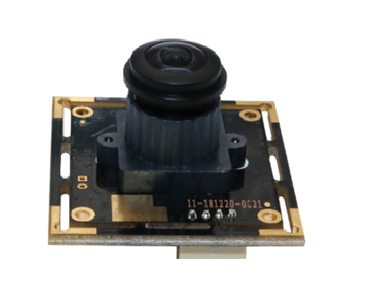]()  
**Specifications** 
**Cost and Sourcing Link**: USD 49.00. [Buy here](https://astar.ai/11580702779/checkouts/656f0c88906342437dca38bec626f934) 
**Sensor**: NA   
**Shutter Type**: Rolling   
**Resolution and Frame rate**: 1280 x 960 at 30 fps (Max.)  
**Sensor Size**: NA  
**Color/Monochrome**: RGB Color  
**Lens Mount**: M12  
**Dimensions**: 38 mm x 38 mm  
**Weight**: NA (with lens)   
**Additional Notes**: Pre-calibrated to less than 0.3 px RMSE.  

<a name="calicamstereo"/>

###### [CaliCam Fisheye Stereo](https://astar.ai/collections/astar-products/products/stereo-camera)  
[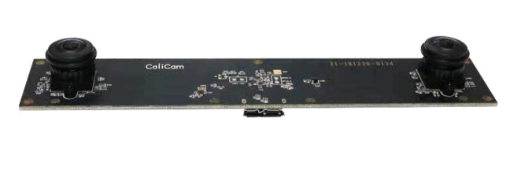]()  
**Specifications** 
**Cost and Sourcing Link**: USD 139.00. [Buy here](https://astar.ai/11580702779/checkouts/4bfe57ca739d66f19d46733cdc454835) 
**Sensor**: NA   
**Shutter Type**: Rolling   
**Resolution and Frame rate**: 2560 x 960 at 30 fps (Max.)  
**Baseline**: 120 mm  
**Sensor Size**: NA  
**Color/Monochrome**: RGB Color  
**Lens Mount**: M12  
**Dimensions**: 150 mm x 30 mm  
**Weight**: NA (with lens)   
**Additional Notes**: Pre-calibrated to less than 0.3 px RMSE.  

<a name="rgbd"/>

##### RGBD Cameras 

<a name="xtion"/>

###### [Asus Xtion Pro Live](https://www.asus.com/us/3D-Sensor/Xtion_PRO_LIVE/)  
  
**Specifications** 
**Cost and Sourcing Link**: NA anymore.  
**Depth Range**: 800 mm to 3500 mm  
**Resolution and Frame rate**: Images at 1280 x 1024 at 30 fps (Max.), Depth at 640 x 480 at 30 fps (Max.)  
**Color/Monochrome**: RGB Color  
**Dimensions**: 457 mm x 89 mm x 127 mm 
**Weight**: 540 g   
**Additional Notes**: Includes microphones as well.  

<a name="realsense"/>

###### [Intel RealSense D435i](https://www.intelrealsense.com/depth-camera-d435i/)  
[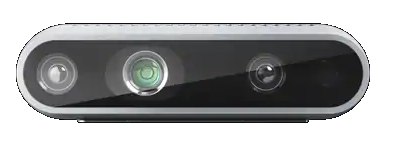]()  
**Specifications** 
**Cost and Sourcing Link**: USD 199.00. [Buy here](https://store.intelrealsense.com/buy-intel-realsense-depth-camera-d435i.html?_ga=2.70691472.1422643180.1556026875-1272969693.1548211961) 
**Depth Range**: 105 mm to 10000 mm  
**Resolution and Frame rate**: Images at 1920 x 1080 at 30 fps (Max.), Depth at 1280 x 720 at 90 fps (Max.)  
**Color/Monochrome**: RGB Color  
**Dimensions**: 99 mm x 25 mm x 25 mm 
**Weight**: 540 g   
**Additional Notes**: Includes IMU as well. More versions available [here](https://store.intelrealsense.com/). 

<a name="eventcameras"/>

##### Event Cameras 

<a name="davis240c"/>

###### [DAVIS 240C](https://inivation.com/buy/)  
[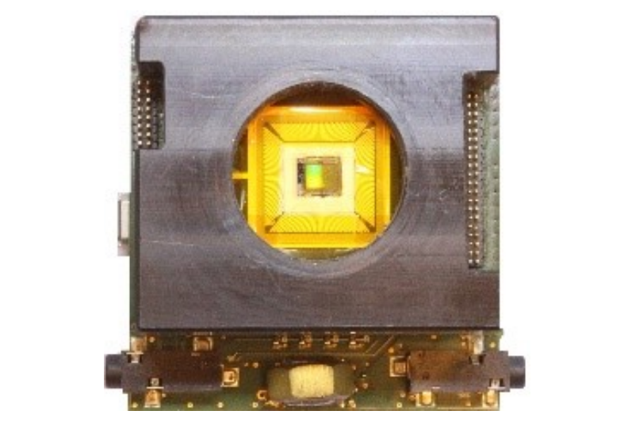]()  
**Specifications** 
**Cost and Sourcing Link**: USD 3525.00 with Academic Discount. [Buy here](https://inivation.com/buy/) 
**Imaging Shutter Type**: Global   
**Resolution and Event Rate**: 240 x 180 at 12 MEPS (Max.)  
**Sensor Size**: 1/3"  
**Color/Monochrome**: RGB Color  
**Lens Mount**: CS  
**Dimensions**: 56 mm x 62 mm x 28 mm  
**Weight**: 75 g (without lens)   
**Additional Notes**:  

<a name="davis346"/>

###### [DAVIS 346](https://inivation.com/buy/)  
[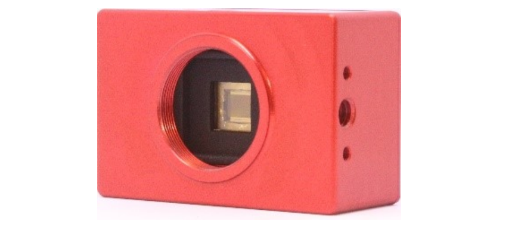]()  
**Specifications** 
**Cost and Sourcing Link**: USD 5678.00 with Academic Discount. [Buy here](https://inivation.com/buy/) 
**Imaging Shutter Type**: Global   
**Resolution and Event Rate**: 346 x 260 at 12 MEPS (Max.)  
**Sensor Size**: 1/3.33"  
**Color/Monochrome**: RGB Color  
**Lens Mount**: CS  
**Dimensions**: 40 mm x 60 mm x 25 mm  
**Weight**: 100 g (without lens)   
**Additional Notes**:  

<a name="insightness"/>

###### [Silicon Eye Rino 3.0](http://www.insightness.com/)  
[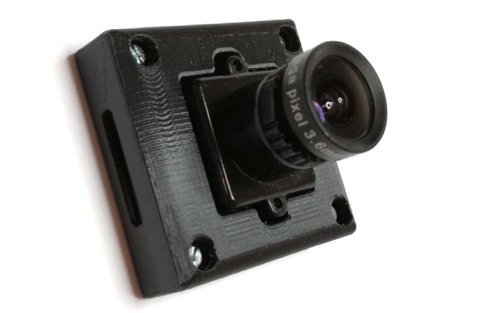]()  
**Specifications** 
**Cost and Sourcing Link**: USD 6000.00 with Academic Discount [Buy here](http://www.insightness.com/) 
**Imaging Shutter Type**: Global   
**Resolution and Event Rate**: 320 x 262 at 40 MEPS clocked at 10KHz (Max.)  
**Sensor Size**: 1/3.2"  
**Color/Monochrome**: RGB Color  
**Lens Mount**: M12  
**Dimensions**: 35 mm x 35 mm x 28 mm  
**Weight**: 15 g (without lens)   
**Additional Notes**: Includes an MPU-9250 IMU as well. Also includes event visual inertial odometry software package as well. 

<a name="prophesee"/>

###### [Prophesee VGA Sensor](https://www.prophesee.ai/)  
[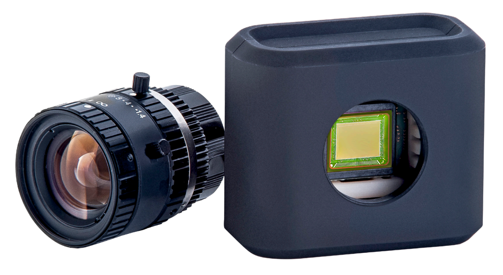]()  
**Specifications** 
**Cost and Sourcing Link**: USD 4500.00 for camera and USD 1200.00 for sensor. [Buy here](https://www.prophesee.ai/) 
**Imaging Shutter Type**: Global   
**Resolution and Event Rate**: 640 x 480 at 40 MEPS clocked at 10KHz (Max.)  
**Sensor Size**: 3/4"  
**Color/Monochrome**: RGB Color  
**Lens Mount**: C  
**Dimensions**: 60 mm x 50 mm x 37 mm  
**Weight**: 146 g (with the lens)   
**Additional Notes**: Includes an IMU as well.  

<a name="lidar"/>

#### LIDAR

<a name="puck"/>

###### [Velodyne Puck VLP-16](https://velodynelidar.com/vlp-16.html)  
[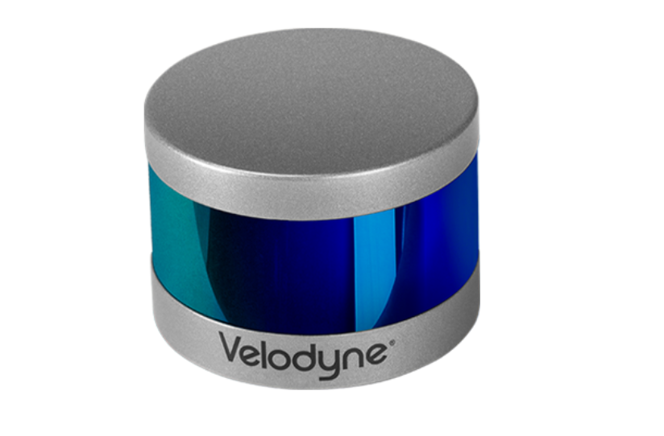]()  
**Specifications** 
**Cost and Sourcing Link**: USD 4000.00 after the price cut in Jan, 2018. [Buy here](https://velodynelidar.com/vlp-16.html) 
**Measurement Range**: 100 m   
**Measurement Accuracy**: 3 cm   
**Field of View**: 3D, Vertical 30 degrees, Horizontal 360 degrees for 16 channels   
**Resolution**: Angular 0.1 - 0.4 degrees  
**Rate**: 20 Hz (Max.)  
**Dimensions**: 103.3 mm x 103.3 mm x 71.7 mm  
**Weight**: 830 g (without cabling and interface box)   
**Additional Notes**:  

<a name="rplidar"/>

###### [RPLidar A3](http://www.slamtec.com/en/lidar/A3)  
[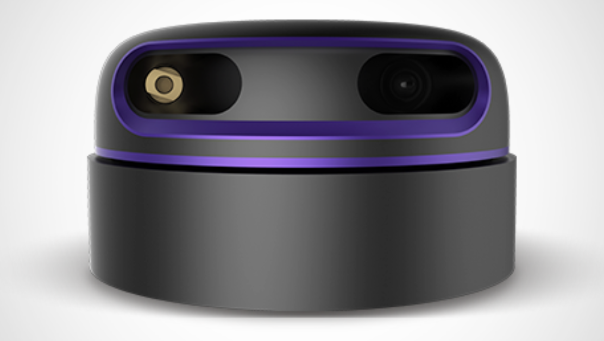]()  
**Specifications** 
**Cost and Sourcing Link**: USD 599.00. [Buy here](https://www.robotshop.com/en/slamtec-rplidar-a3-360-laser-scanner-25-m.html) 
**Measurement Range**: 25 m   
**Measurement Accuracy**: 3 cm   
**Field of View**: 2D, Horizontal 360 degrees   
**Resolution**: Angular 0.3375 degrees   
**Rate**: 20 Hz (Max.)  
**Dimensions**: 76 mm x 76 mm x 41 mm  
**Weight**: 190 g   
**Additional Notes**:  

<a name="ouster"/>

###### [Ouster OS1](https://www.ouster.io/product-os1)  
[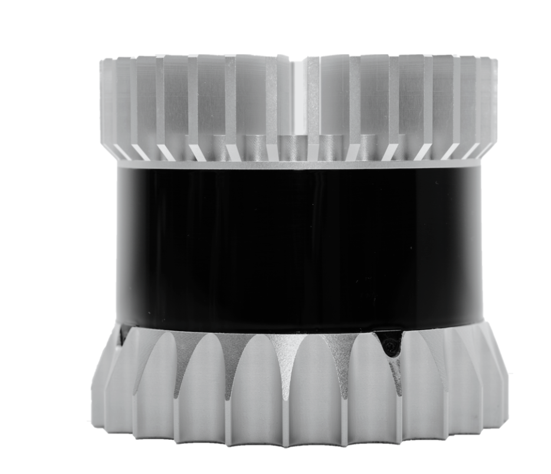]()  
**Specifications** 
**Cost and Sourcing Link**: USD 8000.00. [Buy here](https://www.ouster.io/talk-to-sales) 
**Measurement Range**: 120 m   
**Measurement Accuracy**: 3 cm   
**Field of View**: 3D, Vertical 33.2 degrees, Horizontal 360 degrees for 64 channels   
**Resolution**: Angular 0.18 degrees (horizontal), 0.52 degrees (vertical)  
**Rate**: 20 Hz (Max.)  
**Dimensions**: 80 mm x 80 mm x 74 mm  
**Weight**: 380 g   
**Additional Notes**: Includes an IMU.  

<a name="lidarlite"/>

###### [Garmin LIDAR-Lite v3](https://buy.garmin.com/en-US/US/p/557294)  
[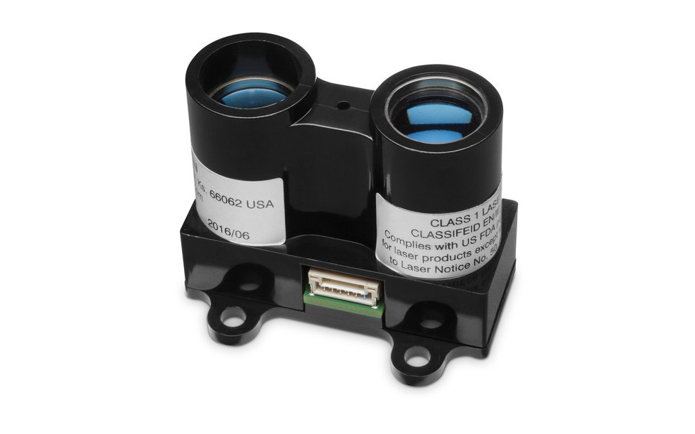]()  
**Specifications** 
**Cost and Sourcing Link**: USD 129.99. [Buy here](https://buy.garmin.com/en-US/US/p/557294) 
**Measurement Range**: 5 cm to 40 m   
**Measurement Accuracy**: 2.5 cm   
**Field of View**: 1 beam LIDAR   
**Resolution**: 1 cm  
**Rate**: 500 Hz (Max.)  
**Dimensions**: 40 mm x 48 mm x 20 mm  
**Weight**: 22 g   
**Additional Notes**:   

<a name="tof"/>

#### Time of Flight or IR Range Sensors

<a name="terarangerone"/>

###### [TeraRanger One](https://www.terabee.com/shop/lidar-tof-range-finders/teraranger-one/)  
[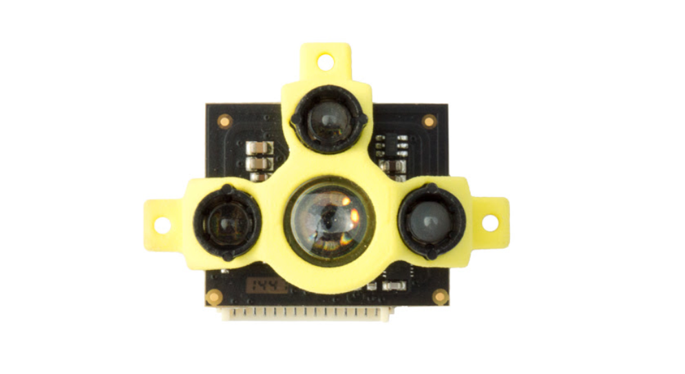]()  
**Specifications** 
**Cost and Sourcing Link**: USD 140.00. [Buy here](https://www.terabee.com/shop/lidar-tof-range-finders/teraranger-one/) 
**Measurement Range**: 14 m (Max.)   
**Measurement Accuracy**: 4 cm   
**Field of View**: 1 beam LIDAR   
**Resolution**: 0.5 cm  
**Field of View**: 3 degrees  
**Rate**: 1000 Hz (Max.)  
**Dimensions**: 29 mm x 18 mm x 35 mm  
**Weight**: 8 g   
**Additional Notes**:   

<a name="terabee3dcam"/>

###### [TeraBee 3Dcam 80x60](https://www.terabee.com/shop/3d-tof-cameras/terabee-3dcam/)  
[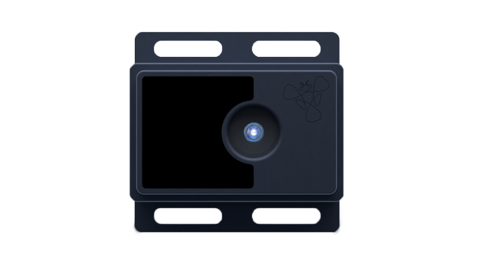]()  
**Specifications** 
**Cost and Sourcing Link**: USD 280.00. [Buy here](https://www.terabee.com/shop/3d-tof-cameras/terabee-3dcam/) 
**Resolution**: 80 x 60 px.  
**Field of View**: 74 degrees x 57 degrees  
**Measurement Range**: 0.2 m - 1.2 m (close range mode), 1 m - 4 m (normal mode)   
**Measurement Accuracy**: 4 cm   
**Depth Resolution**: 1% of distance  
**Rate**: 30 Hz (Max.)  
**Dimensions**: 54 mm x 53 mm x 24 mm  
**Weight**: 83 g (with casing)   
**Additional Notes**:   

<a name="sharp"/>

###### [Sharp GP2Y0A21YK0F Analog Distance Sensor](https://www.pololu.com/product/136)  
[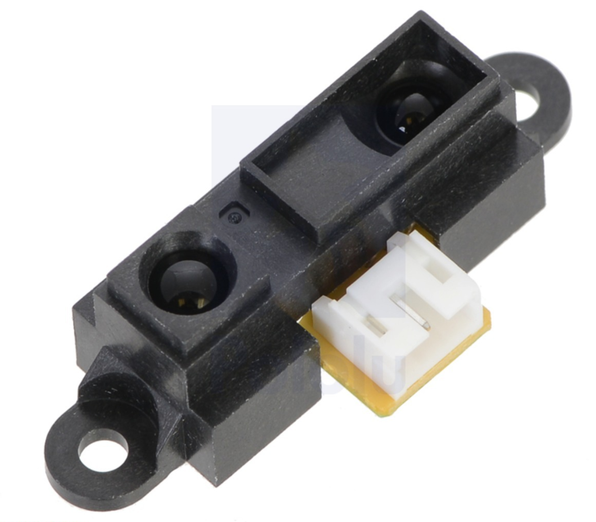]()  
**Specifications** 
**Cost and Sourcing Link**: USD 10.95. [Buy here](https://www.pololu.com/product/136) 
**Measurement Range**: 10 cm - 80 cm   
**Depth Resolution**: 1% of distance  
**Rate**: 26 Hz (Max.)  
**Dimensions**: 44.5 mm x 19 mm x 12.7 mm  
**Weight**: 3.5 g   
**Additional Notes**:   

<a name="monostar"/>

###### [CamBoard Pico MonoStar](https://pmdtec.com/picofamily/monstar/)  
[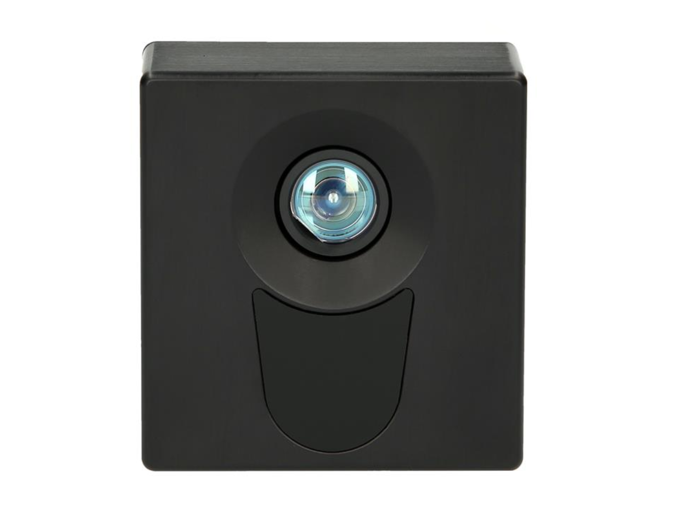]()  
**Specifications** 
**Cost and Sourcing Link**: USD 1935.00. [Buy here](https://www.automation24.com/development-kit-pmd-vision-r-camboard-pico-monstar-700-000-095) 
**Resolution**: 352 x 287 px.  
**Field of View**: 100 degrees x 85 degrees  
**Measurement Range**: 0.5 m - 6 m   
**Depth Resolution**: 1% of distance  
**Rate**: 60 Hz (Max.)  
**Dimensions**: 62 mm x 66 mm x 29 mm  
**Weight**: 142 g (with casing)   
**Additional Notes**:   

<a name="sonar"/>

#### SONAR

<a name="maxsonarez1"/>

###### [MaxSonar EZ1](https://www.maxbotix.com/Ultrasonic_Sensors/MB1010.htm)  
[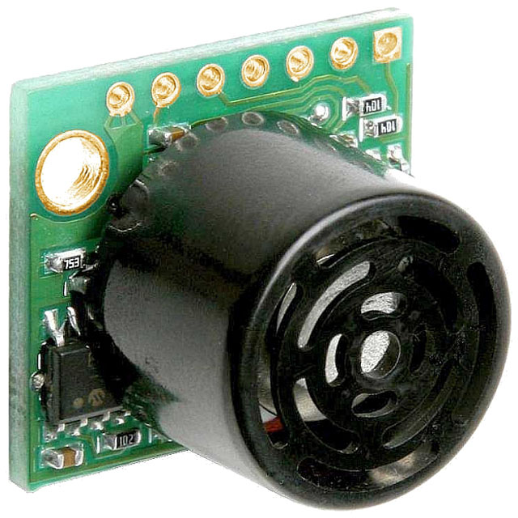]()  
**Specifications** 
**Cost and Sourcing Link**: USD 29.95. [Buy here](https://www.maxbotix.com/Ultrasonic_Sensors/MB1010.htm) 
**Measurement Range**: 6 m (Max.)   
**Rate**: 20 Hz (Max.)  
**Dimensions**: 15.5 mm x 22.3 mm x 20 mm  
**Weight**: 4.3 g (with casing)   
**Additional Notes**:   

<a name="imu"/>

#### IMUs

<a name="vectornav"/>

###### [VectorNav VN-100](https://www.vectornav.com/products/vn-100)  
[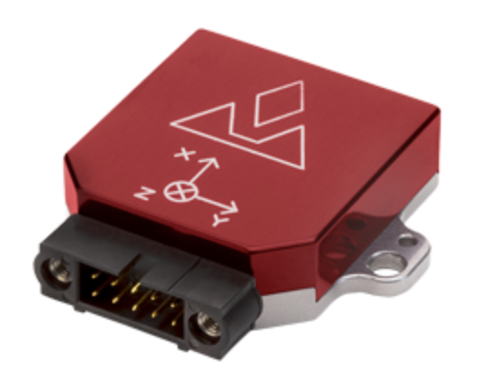]()  
**Specifications** 
**Cost and Sourcing Link**: USD 500.00/800.00 for SMD version with standard/thermal calibration. USD 800.00/1100.00 for Rugged version with standard/thermal calibration. [Buy here](https://www.vectornav.com/products/vn-100) 
**Gyroscope Range**: 2000 degree/sec 
**Gyroscope Resolution**: 0.02 degree/sec 
**Gyroscope Bias Stability**: 10 degree/hour 
**Accelerometer Range**: 16 g 
**Accelerometer Resolution**: 0.5 mg 
**Accelerometer Bias Stability**: 0.04 mg 
**Rate**: 800 Hz (Max.), 400 Hz (Angles)  
**Dimensions**: 36 mm x 33 mm x 9 mm (rugged), 24 mm x 22 mm x 3 mm (SMD)  
**Weight**: 15 g (rugged), 3.5 g (SMD)   
**Additional Notes**: Runs EKF on-board to output attitude as euler angles or quaternion or rotation matrix. Temparature compensated. 

<a name="variense"/>

###### [Variense VMU931](https://variense.com/product/vmu931/)  
[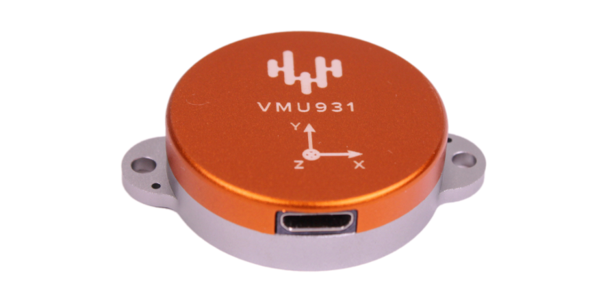]()  
**Specifications** 
**Cost and Sourcing Link**: USD 99.00. [Buy here](https://variense.com/product/vmu931/) 
**Gyroscope Range**: 2000 degree/sec 
**Gyroscope Resolution**: 0.03 degree/sec 
**Gyroscope Bias Stability**: 5 degree/hour 
**Accelerometer Range**: 16 g 
**Accelerometer Resolution**: NA 
**Accelerometer Bias Stability**: NA  
**Rate**: 1000 Hz (Max.), 200 Hz (Angles)  
**Dimensions**: 31 mm x 31 mm x 9.5 mm 
**Weight**: 10 g   
**Additional Notes**: Runs EKF on-board to output attitude as euler angles or quaternion or rotation matrix. 

<a name="mpu9250"/>

###### [InvenSense MPU-9250](https://www.invensense.com/products/motion-tracking/9-axis/mpu-9250/)  
[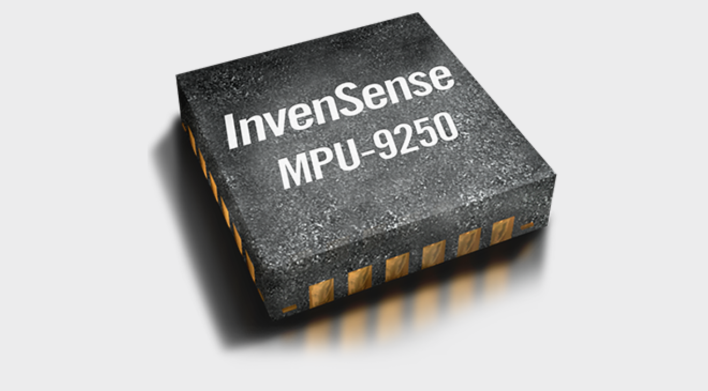]()  
**Specifications** 
**Cost and Sourcing Link**: USD 14.95. [Buy here](https://www.sparkfun.com/products/13762) 
**Gyroscope Range**: 2000 degree/sec 
**Gyroscope Resolution**: NA  
**Gyroscope Bias Stability**: NA 
**Accelerometer Range**: 16 g 
**Accelerometer Resolution**: NA 
**Accelerometer Bias Stability**: NA  
**Rate**: 4000 Hz (Accelerometer), 800 Hz (Gyroscope)  
**Dimensions**: 3 mm x 3 mm x 1 mm 
**Weight**: NA   
**Additional Notes**:  

<a name="xsensmti"/>

###### [Xsens MTi 1-series](https://www.xsens.com/products/mti-1-series/)  
[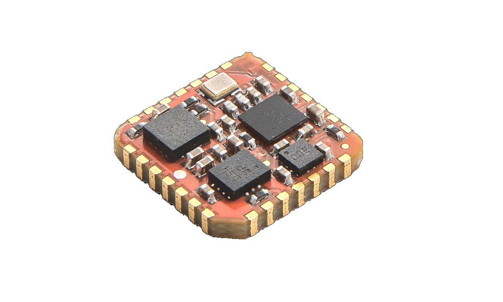]()  
**Specifications** 
**Cost and Sourcing Link**: USD 391.50. [Buy here](https://www.mouser.com/ProductDetail/Xsens/MTi-7-T?qs=%2Fha2pyFaduiUpS1K0sY1DhAAQeOaUjZzmgwzWG0xBpX6lPKF5WC4Mw%3D%3D) 
**Gyroscope Range**: 2000 degree/sec 
**Gyroscope Resolution**: NA  
**Gyroscope Bias Stability**: 18 degrees/hour 
**Accelerometer Range**: 16 g 
**Accelerometer Resolution**: NA 
**Accelerometer Bias Stability**: 0.03 mg  
**Rate**: 4000 Hz (Accelerometer), 800 Hz (Gyroscope)  
**Dimensions**: 12.1 mm x 12.1 mm  
**Weight**: 0.66 g   
**Additional Notes**: Runs XKF3 sensor fusion on-board to give orientation. More specification details can be found [here](https://www.unmannedsystemstechnology.com/company/xsens/).  
 
